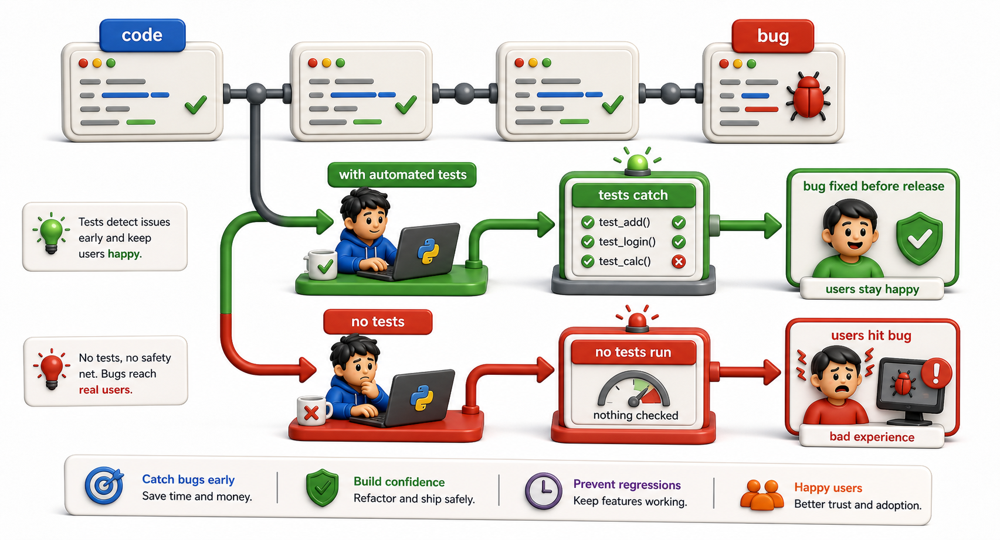

## Introduction

Sam pushed a small change to the library system on a Friday afternoon: a one-line fix to the overdue-fine calculator. On Monday, the system sent incorrect fine notices to three hundred patrons. The bug was not in the one line he changed -- it was in a helper function that his change started calling in a new code path. There were no tests. The bug was invisible until real patrons reported it.

His team lead's response was not a reprimand but a question: "What would have caught this before it reached production?" The answer is tests. This unit explains what tests are, why they matter, and how to write them with Python's `pytest` framework.



## What Testing Is

A test is code that calls your code and checks that the result is what you expect. That is the entire idea. The sophistication is in which scenarios you test and how you organize and run those checks.

```python
# The function Sam changed:
def calculate_fine(days_overdue, daily_rate=0.50):
    return days_overdue * daily_rate

# A test: call the function and check the result
result = calculate_fine(10)
assert result == 5.0, f"Expected 5.0, got {result}"

# Demo:
result = calculate_fine(5, 5)
print(f"calculate_fine(5, 5) ->", result)
```

Running this after every change catches regressions: situations where a previously working feature stops working because something unrelated changed.

## Why Automated Tests Beat Manual Verification

Sam verified his change manually: he borrowed one book, returned it ten days late, and confirmed the fine was correct. He did not check: borrowed on the last day of the month, borrowed on February 29, borrowed by a patron with an existing outstanding balance, or the edge case where `days_overdue` is zero.

Automated tests check all these cases every time, in seconds, without anyone having to remember them:

```python
def test_fine_zero_days():
    assert calculate_fine(0) == 0.0

def test_fine_ten_days():
    assert calculate_fine(10) == 5.0

def test_fine_custom_rate():
    assert calculate_fine(10, daily_rate=1.00) == 10.0

def test_fine_one_day():
    assert calculate_fine(1) == 0.50

# Run the tests:
try:
    test_fine_zero_days()
    print("PASS: test_fine_zero_days")
except AssertionError as e:
    print("FAIL:", e)
try:
    test_fine_ten_days()
    print("PASS: test_fine_ten_days")
except AssertionError as e:
    print("FAIL:", e)
try:
    test_fine_custom_rate()
    print("PASS: test_fine_custom_rate")
except AssertionError as e:
    print("FAIL:", e)
```

After Sam adds these four tests, any future change that breaks the fine calculation is caught immediately, not by three hundred confused patrons.

## The Three Values of Testing

**Safety to change**: tests let you refactor and add features with confidence. If all tests pass after a change, the previously verified behavior still works.

**Documentation**: tests describe what the code is supposed to do. A new developer reading `test_fine_zero_days` learns that the function accepts zero and returns zero, without reading the implementation.

**Design pressure**: writing tests often reveals when code is hard to test, which usually means it is also hard to use. Functions with too many responsibilities, hidden side effects, or hard-coded dependencies are all harder to test. Testing pressure is a signal to improve the design.

## What to Test

The most valuable tests cover:

- **Normal cases**: the expected, common inputs
- **Edge cases**: the boundaries (zero, empty, maximum value, first and last day of a period)
- **Error cases**: what happens when invalid input is passed

```python
def calculate_fine(days_overdue, daily_rate=0.50):
    return days_overdue * daily_rate

# Normal case
assert calculate_fine(7) == 3.50
print(f"PASS: calculate_fine(7) == 3.50")

# Edge: zero days
assert calculate_fine(0) == 0.0
print(f"PASS: calculate_fine(0) == 0.0")

# Edge: large number
assert calculate_fine(365) == 182.50
print(f"PASS: calculate_fine(365) == 182.50")

# Error case: negative input -- you decide the correct behavior
result = calculate_fine(-1)
print(f"INFO: calculate_fine(-1) = {result}  (is negative fine correct? a design decision)")
```

## What Not to Test

Not every line of code needs a test. Testing Python itself (that `1 + 1 == 2`) or testing the framework you are using wastes time without adding safety. Focus tests on *your* logic.

## Why Test at a Glance

| Value | What it means |
|---|---|
| Safety to change | Regressions are caught before reaching users |
| Documentation | Tests show what the code is supposed to do |
| Design feedback | Hard-to-test code is often hard to use |
| Edge case coverage | Checks scenarios humans forget |

## Your Turn

Look at Nadia's `overdue_report` function from Unit 7:

```python
from datetime import date, timedelta

def overdue_report(records, today=None):
    today = today or date.today()
    overdue = []
    for record in records:
        borrow = date.fromisoformat(record["borrow_date"])
        due = borrow + timedelta(days=record["loan_days"])
        if today > due:
            overdue.append({**record, "days_overdue": (today - due).days})
    return overdue

# Demo:
records = [
    {"borrow_date": "2024-06-01", "loan_days": 14},
    {"borrow_date": "2024-06-10", "loan_days": 21},
    {"borrow_date": "2024-06-18", "loan_days": 7},
]
result = overdue_report(records, today=date(2024, 6, 26))
print(f"Overdue records: {len(result)}")
for r in result:
    print(f"  borrow_date={r['borrow_date']}, days_overdue={r['days_overdue']}")

Without running the code, write down four test cases you would write for this function: one normal case, one edge case where no books are overdue, one edge case where a book is exactly on its due date, and one edge case where the records list is empty.

## Conclusion

Tests are code that calls your code and checks the result. They catch regressions before they reach users, document intended behavior, and create design pressure toward simpler, more focused functions. The next lesson introduces `assert` as the foundation of all testing, and shows how to write and run tests with `pytest`.
