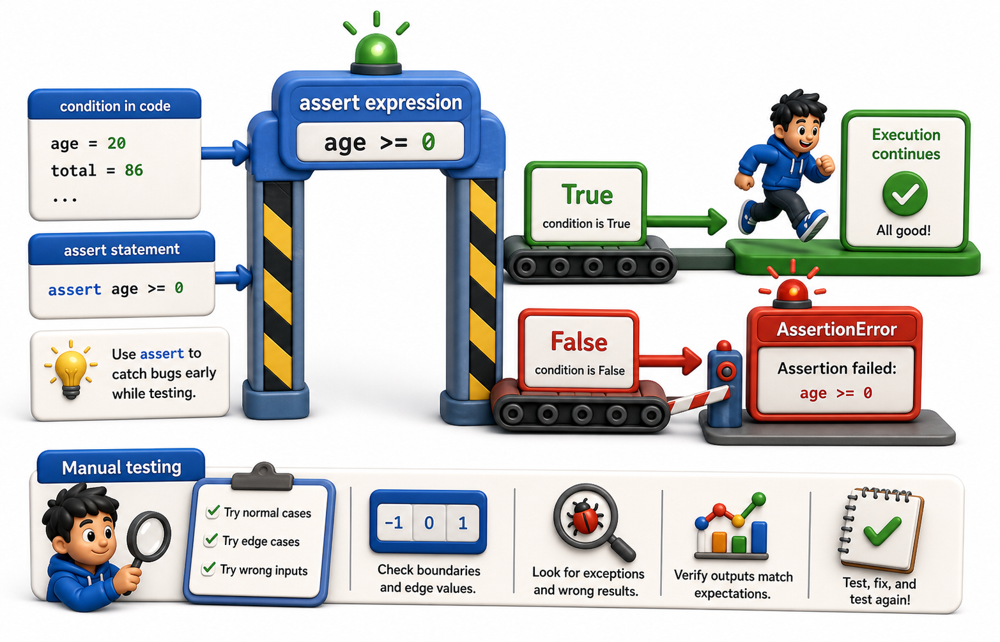

## Introduction

Before Sam learns about any testing framework, his team lead wants him to understand the single building block that all Python tests are built on: the `assert` statement. It is already in the language and requires no installation. Understanding it well makes everything in the testing framework more intuitive.



## The assert Statement

`assert expression` does nothing if `expression` is truthy, and raises `AssertionError` if it is falsy. It is the programmatic version of "this must be true here."

```python
# Passes: no output, no error (silent success)
assert 1 + 1 == 2
assert len("hello") == 5
assert [1, 2, 3] != []
print("First 3 assertions passed silently")

# Failing assert raises AssertionError:
try:
    assert 1 + 1 == 3    # False -- raises AssertionError
except AssertionError:
    print("AssertionError raised: 1+1 != 3 (as expected)")

# With a message -- the message appears in the AssertionError:
result = 5
try:
    assert result == 10, f"Expected 10, got {result}"
except AssertionError as e:
    print(f"AssertionError: {e}")
```

Always include a message. Without one, the error says only `AssertionError` with no indication of what was wrong.

## Asserting with Context

The most useful assertions compare expected and actual values directly:

```python
def calculate_fine(days_overdue, daily_rate=0.50):
    return days_overdue * daily_rate

# Test by calling the function and asserting the result
actual = calculate_fine(10)
expected = 5.0
assert actual == expected, f"Fine for 10 days: expected {expected}, got {actual}"
print(f"PASS: calculate_fine(10) == {expected}")

actual = calculate_fine(0)
assert actual == 0.0, f"Fine for 0 days: expected 0.0, got {actual}"
print(f"PASS: calculate_fine(0) == 0.0")
```

## Asserting Exceptions

To test that a function raises a specific exception, you need to catch it and confirm the type. Python's `pytest` framework provides a cleaner way (covered in the next lesson), but the raw approach shows what is happening underneath:

```python
def get_book(isbn, catalog):
    if isbn not in catalog:
        raise KeyError(f"Book not found: {isbn}")
    return catalog[isbn]

# Test that the exception is raised:
raised = False
try:
    get_book("missing-isbn", {})
except KeyError as e:
    raised = True
    print(f"KeyError raised as expected: {e}")

assert raised, "Expected KeyError was not raised"
print("PASS: get_book raises KeyError for missing isbn")

# Test the happy path:
catalog = {"978-001": {"title": "Dune"}}
book = get_book("978-001", catalog)
print(f"PASS: get_book('978-001') -> {book}")
```

## Floating-Point Comparisons

Floating-point arithmetic introduces rounding errors. Never compare floats with `==` in tests:

```python
import math

# Demonstrate the float precision problem
actual = 0.1 + 0.2
print(f"0.1 + 0.2 = {actual!r}")    # 0.30000000000000004
print(f"== 0.3: {actual == 0.3}")   # False!

# WRONG: assert 0.1 + 0.2 == 0.3 would raise AssertionError

# Safe: compare within a tolerance using math.isclose
is_close = math.isclose(0.1 + 0.2, 0.3, rel_tol=1e-9)
print(f"math.isclose(0.1+0.2, 0.3): {is_close}")   # True

# In tests, always use math.isclose for float comparisons:
assert math.isclose(0.1 + 0.2, 0.3, rel_tol=1e-9)
print("PASS: float comparison with tolerance works correctly")
```

`math.isclose` checks whether two floats are equal within a relative tolerance. Use it whenever testing float results.

## Running Tests Manually

A simple manual test file collects all assertions into functions. Running the file with Python executes them:

```python
import math

def calculate_fine(days_overdue, daily_rate=0.50):
    return days_overdue * daily_rate

def test_fine_normal():
    assert math.isclose(calculate_fine(10), 5.0)

def test_fine_zero_days():
    assert calculate_fine(0) == 0.0

def test_fine_custom_rate():
    assert math.isclose(calculate_fine(10, daily_rate=1.00), 10.0)

# Run tests manually (pytest would discover and run these automatically)
for test_fn in [test_fine_normal, test_fine_zero_days, test_fine_custom_rate]:
    try:
        test_fn()
        print(f"PASS: {test_fn.__name__}")
    except AssertionError as e:
        print(f"FAIL: {test_fn.__name__}: {e}")
```

This works but has a limitation: if one test fails, the rest do not run. A testing framework like `pytest` runs all tests and reports all failures at once.

## assert in Production Code

`assert` in production code is risky: Python can be run with the `-O` (optimize) flag, which strips all `assert` statements. Use `raise` instead for runtime validation that must always run:

```python
# Use raise instead of assert for input validation in production code:
# assert is stripped by Python's -O (optimize) flag and will silently vanish!
def calculate_fine(days_overdue, daily_rate=0.50):
    if days_overdue < 0:
        raise ValueError(f"days_overdue cannot be negative: {days_overdue}")
    return days_overdue * daily_rate

# Happy path
print(f"calculate_fine(10) = {calculate_fine(10)}")

# Error path -- ValueError always raised, even with python -O
try:
    calculate_fine(-5)
except ValueError as e:
    print(f"ValueError: {e}")
```

`assert` belongs in test code; `raise` belongs in production code.

## assert at a Glance

| Form | What it does |
|---|---|
| `assert expr` | Raises `AssertionError` if expr is falsy |
| `assert expr, msg` | Same, with a descriptive message |
| `math.isclose(a, b)` | Safe float comparison within tolerance |
| `assert raised` after try/except | Verify exception was raised |

## Your Turn

Write a file `test_manual.py` with at least five test functions for `calculate_fine`. Include: normal case, zero days, one day, large number of days, and a case with a custom daily rate. Run the file with `python test_manual.py` and confirm all tests pass.

```python
import math

def calculate_fine(days_overdue, daily_rate=0.50):
    if days_overdue < 0:
        raise ValueError("days_overdue cannot be negative")
    return days_overdue * daily_rate

def test_normal():
    assert math.isclose(calculate_fine(10), 5.0)

def test_zero():
    assert calculate_fine(0) == 0.0

def test_one_day():
    assert math.isclose(calculate_fine(1), 0.50)

def test_large():
    assert math.isclose(calculate_fine(100), 50.0)

def test_custom_rate():
    assert math.isclose(calculate_fine(10, daily_rate=1.00), 10.0)

def test_negative_raises():
    raised = False
    try:
        calculate_fine(-1)
    except ValueError:
        raised = True
    assert raised, "Expected ValueError for negative input"

if __name__ == "__main__":
    test_normal()
    test_zero()
    test_one_day()
    test_large()
    test_custom_rate()
    test_negative_raises()
    print("All tests passed.")
```

## Conclusion

`assert` is the foundation of Python testing: it checks a condition and raises `AssertionError` with a message if it fails. Use `math.isclose` for floats. Reserve `raise` for production validation and `assert` for test code. The next lesson introduces `pytest`, which discovers and runs these functions automatically, collects all failures in one report, and provides much better error messages than raw assertions.
