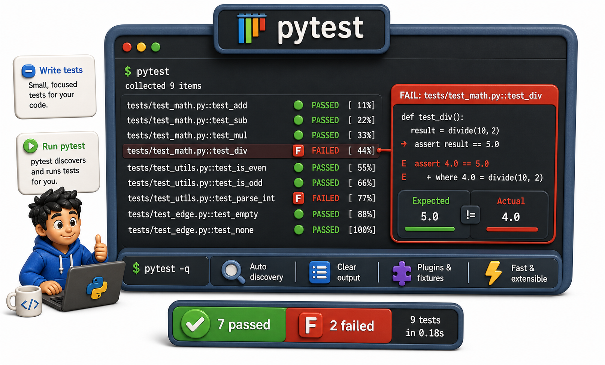

## Introduction

Sam's manual test file works but has a problem: when test 2 fails, tests 3 through 6 never run. He must fix test 2, re-run, find test 4 also fails, fix that, re-run again. He is getting the failures one at a time when he needs them all at once.

`pytest` solves this. It discovers all test functions in a project, runs them all regardless of which ones fail, and prints a clear report of every failure with the line, the expected value, and the actual value. Installing it is one command; using it is just naming your functions `test_`.



## Installing pytest

```console
pip install pytest
```

That is the only setup required. `pytest` is not part of the standard library, but it is the de facto standard Python testing tool.

## Writing Tests for pytest

`pytest` discovers test functions automatically: it looks for files named `test_*.py` or `*_test.py`, and within those files it finds functions named `test_*`. No imports, no registration, no boilerplate required.

```python
# test_fines.py
import math

def calculate_fine(days_overdue, daily_rate=0.50):
    if days_overdue < 0:
        raise ValueError("days_overdue cannot be negative")
    return days_overdue * daily_rate

def test_fine_normal():
    assert math.isclose(calculate_fine(10), 5.0)

def test_fine_zero_days():
    assert calculate_fine(0) == 0.0

def test_fine_custom_rate():
    assert math.isclose(calculate_fine(10, daily_rate=1.00), 10.0)

def test_fine_negative_raises():
    # This is the pytest way to test exceptions (next lesson)
    pass

# Run the tests:
try:
    test_fine_normal()
    print("PASS: test_fine_normal")
except AssertionError as e:
    print("FAIL:", e)
try:
    test_fine_zero_days()
    print("PASS: test_fine_zero_days")
except AssertionError as e:
    print("FAIL:", e)
try:
    test_fine_custom_rate()
    print("PASS: test_fine_custom_rate")
except AssertionError as e:
    print("FAIL:", e)
```

## Running pytest

```console
# Run all discovered tests:
pytest

# Run a specific file:
pytest test_fines.py

# Run a specific test function:
pytest test_fines.py::test_fine_normal

# Verbose output (shows each test name):
pytest -v
```

Sample output:

```
======= test session starts =======
collected 3 items

test_fines.py::test_fine_normal      PASSED
test_fines.py::test_fine_zero_days   PASSED
test_fines.py::test_fine_custom_rate PASSED

======= 3 passed in 0.12s =======
```

## pytest's Error Messages

When a test fails, `pytest` shows a rich diff. For `assert actual == expected`, it shows both values:

```python
import math

def calculate_fine(days_overdue, daily_rate=0.50):
    if days_overdue < 0:
        raise ValueError("days_overdue cannot be negative")
    return days_overdue * daily_rate

def test_fine_normal():
    assert calculate_fine(10) == 6.0   # wrong expected value — this test fails

# Run the tests:
try:
    test_fine_normal()
    print("PASS: test_fine_normal")
except AssertionError as e:
    print(f"FAIL: assert {calculate_fine(10)} == 6.0")
    print("  where", calculate_fine(10), "= calculate_fine(10)")
```

This is far more useful than `AssertionError` with no context.

## Testing Exceptions with pytest.raises

`pytest.raises` is the clean way to test that a function raises a specific exception:

```python
import pytest

def calculate_fine(days_overdue, daily_rate=0.50):
    if days_overdue < 0:
        raise ValueError("days_overdue cannot be negative")
    return days_overdue * daily_rate

def test_fine_negative_raises():
    with pytest.raises(ValueError):
        calculate_fine(-1)

# Check the exception message too:
def test_fine_negative_message():
    with pytest.raises(ValueError, match="cannot be negative"):
        calculate_fine(-1)

# Run the tests:
try:
    test_fine_negative_raises()
    print("PASS: test_fine_negative_raises")
except AssertionError as e:
    print("FAIL:", e)
try:
    test_fine_negative_message()
    print("PASS: test_fine_negative_message")
except AssertionError as e:
    print("FAIL:", e)
```

If the exception is not raised, the test fails. If a different exception is raised, it propagates and the test also fails.

## Organizing Tests in a Project

A common layout puts tests in a `tests/` directory at the project root:

```
library_system/
    library/
        __init__.py
        fines.py
        catalog.py
    tests/
        __init__.py
        test_fines.py
        test_catalog.py
    pyproject.toml
```

Running `pytest` from the project root finds all `test_*.py` files automatically.

## pytest at a Glance

| Command | What it does |
|---|---|
| `pytest` | Discover and run all tests |
| `pytest -v` | Verbose output with test names |
| `pytest test_file.py::test_name` | Run one specific test |
| `pytest.raises(ExcType)` | Assert that an exception is raised |
| `pytest.raises(ExcType, match=pattern)` | Assert exception and check message |

## Your Turn

Move the `calculate_fine` function to its own file `library/fines.py`, then create `tests/test_fines.py`. Import `calculate_fine` and rewrite the manual tests as `pytest` tests, including one that uses `pytest.raises`:

```python
import math
import pytest

# In a real project this would be: from library.fines import calculate_fine
def calculate_fine(days_overdue, daily_rate=0.50):
    if days_overdue < 0:
        raise ValueError("days_overdue cannot be negative")
    return days_overdue * daily_rate

def test_normal():
    assert math.isclose(calculate_fine(10), 5.0)

def test_zero():
    assert calculate_fine(0) == 0.0

def test_custom_rate():
    assert math.isclose(calculate_fine(10, daily_rate=1.00), 10.0)

def test_negative_raises():
    with pytest.raises(ValueError, match="cannot be negative"):
        calculate_fine(-1)

# Run the tests:
for test_fn in [test_normal, test_zero, test_custom_rate, test_negative_raises]:
    try:
        test_fn()
        print(f"PASS: {test_fn.__name__}")
    except AssertionError as e:
        print(f"FAIL: {test_fn.__name__} — {e}")
```

Run `pytest -v` and confirm all four tests pass.

## Conclusion

`pytest` discovers tests by naming convention (`test_*.py`, `test_*`), runs all of them in one pass, and reports every failure with a clear diff. `pytest.raises` replaces the manual try/except pattern for exception testing. The next lesson covers how to organize a growing test suite and write tests that are easy to read, maintain, and run in isolation.
