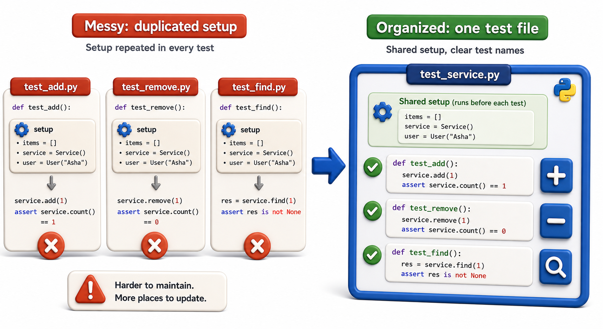

## Introduction

Sam now has eleven test functions spread across two files. Some of them share a common setup: they all create a sample catalog and a few borrow records before running. He is copying the setup code into each test function, which means when the data model changes, he has to update every copy. His team lead shows him how to organize tests so that setup lives in one place and each test focuses only on what it is actually testing.



## The Four-Phase Test Pattern

Well-written tests follow four phases: Arrange (set up the data), Act (call the code), Assert (check the result), Cleanup (optional teardown). Keeping these distinct makes tests readable and maintainable.

```python
# test_catalog.py
from library.catalog import Catalog, Book

def test_add_book_increases_count():
    # Arrange
    catalog = Catalog()
    book = Book(isbn="978-001", title="Dune", genre="Sci-Fi", copies=3)

    # Act
    catalog.add(book)

    # Assert
    assert len(catalog) == 1

def test_find_book_by_isbn():
    # Arrange
    catalog = Catalog()
    book = Book(isbn="978-001", title="Dune", genre="Sci-Fi", copies=3)
    catalog.add(book)

    # Act
    result = catalog.find("978-001")

    # Assert
    assert result.title == "Dune"

# Run the tests:
try:
    test_add_book_increases_count()
    print("PASS: test_add_book_increases_count")
except AssertionError as e:
    print("FAIL:", e)
try:
    test_find_book_by_isbn()
    print("PASS: test_find_book_by_isbn")
except AssertionError as e:
    print("FAIL:", e)
```

Notice that both tests independently set up their own `catalog` and `book`. This is intentional: tests should not depend on each other's state.

## One Assertion per Test (Roughly)

Tests that check many things at once are harder to diagnose. When a multi-assertion test fails, you know *something* went wrong, but not what. Prefer focused tests:

```python
# Hard to diagnose when it fails:
def test_book_properties():
    book = Book(isbn="978-001", title="Dune", genre="Sci-Fi", copies=3)
    assert book.isbn == "978-001"
    assert book.title == "Dune"
    assert book.copies == 3
    assert book.genre == "Sci-Fi"

# Better: one focused check per test (or group related assertions)
def test_book_stores_isbn():
    book = Book(isbn="978-001", title="Dune", genre="Sci-Fi", copies=3)
    assert book.isbn == "978-001"

def test_book_stores_copies():
    book = Book(isbn="978-001", title="Dune", genre="Sci-Fi", copies=3)
    assert book.copies == 3

# Run the tests:
try:
    test_book_properties()
    print("PASS: test_book_properties")
except AssertionError as e:
    print("FAIL:", e)
try:
    test_book_stores_isbn()
    print("PASS: test_book_stores_isbn")
except AssertionError as e:
    print("FAIL:", e)
try:
    test_book_stores_copies()
    print("PASS: test_book_stores_copies")
except AssertionError as e:
    print("FAIL:", e)
```

That said, if two values are invariably tested together (like a pair of coordinates), a single test checking both is fine. The goal is diagnostic clarity, not strict rule-following.

## Test Names as Documentation

Test function names are the first thing you read when a test fails. Name them to describe the scenario and expected behavior:

```python
# Hard to understand what failed:
def test_1():
    ...

def test_catalog():
    ...

# Clear and searchable:
def test_add_book_increases_catalog_length():
    ...

def test_find_returns_none_for_unknown_isbn():
    ...

def test_find_raises_for_invalid_isbn_format():
    ...

# Run the tests:
try:
    test_1()
    print("PASS: test_1")
except AssertionError as e:
    print("FAIL:", e)
try:
    test_catalog()
    print("PASS: test_catalog")
except AssertionError as e:
    print("FAIL:", e)
try:
    test_add_book_increases_catalog_length()
    print("PASS: test_add_book_increases_catalog_length")
except AssertionError as e:
    print("FAIL:", e)
```

The convention `test_<thing>_<scenario>_<expected>` works well for describing edge cases.

## Organizing Tests by Feature

Group tests into files that correspond to the module they test. Use subdirectories for large codebases:

```
tests/
    test_fines.py          # tests for library/fines.py
    test_catalog.py        # tests for library/catalog.py
    test_patron.py         # tests for library/patron.py
    integration/
        test_borrow_flow.py  # tests that span multiple modules
```

Within a file, test functions in the same "group" can be collected into a class. This is not required, but it provides a namespace and allows shared fixtures at the class level:

```python
class TestCatalog:
    def test_empty_at_start(self):
        catalog = Catalog()
        assert len(catalog) == 0

    def test_add_increases_count(self):
        catalog = Catalog()
        catalog.add(Book("978-001", "Dune", "Sci-Fi", 3))
        assert len(catalog) == 1

# Demo:
obj = TestCatalog()
print(obj)
```

## Avoiding Inter-Test Dependencies

Tests must be independent. A test that only works if a previous test ran first is fragile and hard to debug.

```python
# WRONG: test_find depends on test_add having run first
catalog = Catalog()   # shared state at module level

def test_add():
    catalog.add(Book("978-001", "Dune", "Sci-Fi", 3))

def test_find():
    result = catalog.find("978-001")  # only works if test_add ran first
    assert result is not None

# CORRECT: each test creates its own fresh catalog
def test_add():
    c = Catalog()
    c.add(Book("978-001", "Dune", "Sci-Fi", 3))
    assert len(c) == 1

def test_find():
    c = Catalog()
    c.add(Book("978-001", "Dune", "Sci-Fi", 3))
    result = c.find("978-001")
    assert result is not None

# Run the tests:
try:
    test_add()
    print("PASS: test_add")
except AssertionError as e:
    print("FAIL:", e)
try:
    test_find()
    print("PASS: test_find")
except AssertionError as e:
    print("FAIL:", e)
try:
    test_add()
    print("PASS: test_add")
except AssertionError as e:
    print("FAIL:", e)
```

## Writing and Organizing Tests at a Glance

| Principle | What it means |
|---|---|
| Four-phase pattern | Arrange, Act, Assert, (Cleanup) |
| One focus per test | Each test checks one thing |
| Descriptive names | `test_<thing>_<scenario>_<expected>` |
| No shared mutable state | Each test creates its own data |
| Files mirror modules | `test_catalog.py` tests `catalog.py` |

## Your Turn

Write three tests for a `Catalog.remove(isbn)` method:

1. `test_remove_decreases_count` -- adding then removing a book reduces the count by one
2. `test_remove_book_not_in_find` -- after removing, finding that ISBN returns `None`
3. `test_remove_nonexistent_raises` -- removing an ISBN that was never added raises `KeyError`

Write each with the four-phase pattern, using a fresh `Catalog` instance in each test.

## Conclusion

Good test organization means: one focus per test, descriptive names, no shared mutable state between tests, and files that mirror the structure of the code they test. The four-phase pattern (Arrange/Act/Assert/Cleanup) makes the structure of each test immediately readable. The next lesson introduces `pytest` fixtures, which eliminate the duplicated Arrange code by providing shared setup in one place.
