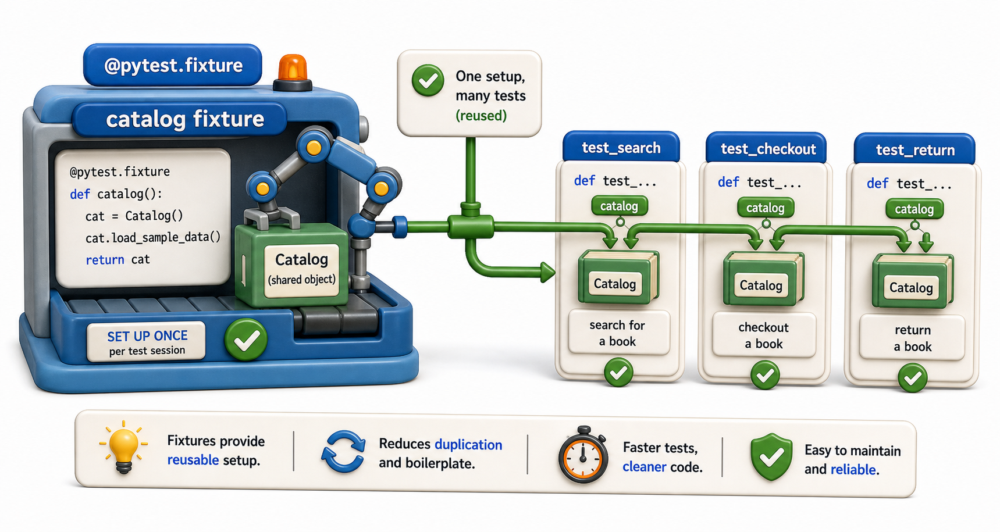

## Introduction

Every one of Sam's catalog tests starts with the same three lines: create a `Catalog`, create a `Book`, add the book to the catalog. When the `Book` constructor signature changes -- which it does when the team adds a `publisher` field -- he has to update every test file. There are twenty-three tests. He spends forty minutes updating setup code instead of testing new behavior.

`pytest` fixtures are the solution. A fixture is a function that provides a pre-built, reusable piece of setup to any test that requests it. Change the fixture once, and every test that uses it is updated automatically.



## Defining and Using a Fixture

A fixture is a function decorated with `@pytest.fixture`. Any test function that declares a parameter with the same name as the fixture receives the fixture's return value automatically.

```python
# tests/test_catalog.py
import pytest
from library.catalog import Catalog, Book

@pytest.fixture
def sample_book():
    return Book(isbn="978-001", title="Dune", genre="Sci-Fi", copies=3)

@pytest.fixture
def catalog_with_book(sample_book):
    c = Catalog()
    c.add(sample_book)
    return c

def test_catalog_length(catalog_with_book):
    assert len(catalog_with_book) == 1

def test_find_book(catalog_with_book):
    result = catalog_with_book.find("978-001")
    assert result is not None
    assert result.title == "Dune"

def test_empty_catalog():
    c = Catalog()   # no fixture needed here
    assert len(c) == 0

# Run the tests:
try:
    test_catalog_length()
    print("PASS: test_catalog_length")
except AssertionError as e:
    print("FAIL:", e)
try:
    test_find_book()
    print("PASS: test_find_book")
except AssertionError as e:
    print("FAIL:", e)
try:
    test_empty_catalog()
    print("PASS: test_empty_catalog")
except AssertionError as e:
    print("FAIL:", e)
```

`pytest` sees that `test_catalog_length` has a parameter named `catalog_with_book`, finds the matching fixture, calls it, and passes its return value as the argument. This happens automatically.

## Fixture Composition

Fixtures can depend on other fixtures, as shown above with `catalog_with_book` depending on `sample_book`. `pytest` resolves the dependency graph and calls fixtures in the right order.

```python
@pytest.fixture
def patron():
    return {"id": "P001", "name": "Alice", "active": True}

@pytest.fixture
def borrow_record(sample_book, patron):
    return {
        "isbn": sample_book.isbn,
        "patron_id": patron["id"],
        "borrow_date": "2026-06-01",
        "loan_days": 21,
    }

def test_overdue_report(borrow_record):
    from datetime import date
    from library.reports import overdue_report
    result = overdue_report([borrow_record], today=date(2026, 7, 15))
    assert len(result) == 1
    assert result[0]["days_overdue"] == 23

# Run the tests:
try:
    test_overdue_report()
    print("PASS: test_overdue_report")
except AssertionError as e:
    print("FAIL:", e)
```

## Fixture Scope

By default, a fixture runs once per test function. For expensive setups (like database connections), `scope` controls how often the fixture is created:

```python
@pytest.fixture(scope="module")   # created once per test file
def db_connection():
    conn = connect_to_test_db()
    yield conn
    conn.close()

@pytest.fixture(scope="session")  # created once for the entire test run
def app_config():
    return load_config("test_config.json")

# Demo:
result = db_connection()
print(f"db_connection() ->", result)
result = app_config()
print(f"app_config() ->", result)
```

| Scope | Created once per |
|---|---|
| `"function"` | Test function (default) |
| `"class"` | Test class |
| `"module"` | Test file |
| `"session"` | Entire test run |

## Fixtures with yield: Setup and Teardown

When a fixture uses `yield` instead of `return`, the code before `yield` runs before the test and the code after `yield` runs after the test (teardown). This is the clean way to manage resources in fixtures.

```python
import sqlite3
import pytest

@pytest.fixture
def in_memory_db():
    conn = sqlite3.connect(":memory:")
    conn.execute("CREATE TABLE books (isbn TEXT, title TEXT)")
    yield conn   # test receives the connection here
    conn.close() # cleanup: always runs after the test

def test_insert_book(in_memory_db):
    in_memory_db.execute("INSERT INTO books VALUES ('978-001', 'Dune')")
    result = in_memory_db.execute("SELECT COUNT(*) FROM books").fetchone()
    assert result[0] == 1

# Run the tests:
try:
    test_insert_book()
    print("PASS: test_insert_book")
except AssertionError as e:
    print("FAIL:", e)
```

## conftest.py: Shared Fixtures

Fixtures in a `conftest.py` file are available to all test files in the same directory and its subdirectories, without any import:

```
tests/
    conftest.py       # fixtures here are shared across all tests/
    test_fines.py
    test_catalog.py
```

```python
# tests/conftest.py
import pytest
from library.catalog import Catalog, Book

@pytest.fixture
def empty_catalog():
    return Catalog()

@pytest.fixture
def sample_book():
    return Book(isbn="978-001", title="Dune", genre="Sci-Fi", copies=3)

# Demo:
result = empty_catalog()
print(f"empty_catalog() ->", result)
result = sample_book()
print(f"sample_book() ->", result)
```

`test_fines.py` and `test_catalog.py` can both use `empty_catalog` and `sample_book` without importing them.

## Fixtures at a Glance

| Concept | What it means |
|---|---|
| `@pytest.fixture` | Marks a function as a fixture |
| Parameter name = fixture name | `pytest` injects it automatically |
| `yield` in fixture | Code after `yield` runs as teardown |
| `scope="module"` | Fixture created once per test file |
| `conftest.py` | Fixtures shared across the directory |

## Your Turn

Create a `tests/conftest.py` with three fixtures: `empty_catalog` (a fresh `Catalog`), `sample_book` (a `Book` with known values), and `loaded_catalog` (a `Catalog` with five pre-loaded books using a `yield` fixture that also prints "setup" and "teardown").

Then write three tests in `tests/test_catalog.py` that each use one of these fixtures. Run `pytest -v` and observe which test is passed each fixture.

## Conclusion

Fixtures centralize setup code so tests stay focused on behavior rather than boilerplate. `yield` fixtures add teardown. `conftest.py` shares fixtures across multiple test files. Fixture scope controls how often expensive setups run. The next lesson adds parameterization: running the same test against many inputs without duplicating the test function.
