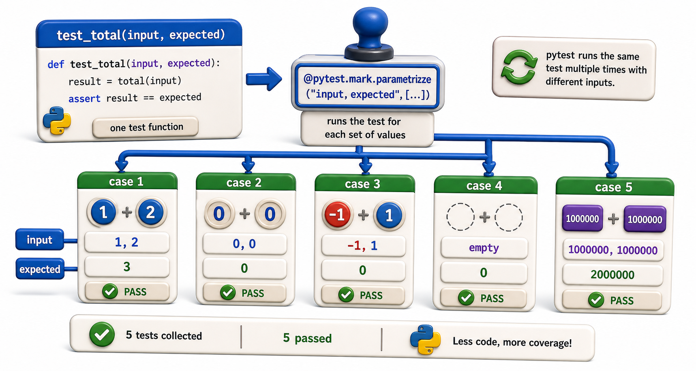

## Introduction

Sam needs to test `calculate_fine` for many different inputs: 0 days, 1 day, 7 days, 14 days, 30 days, 365 days, and two custom daily rates. Writing a separate test function for each combination means eleven almost-identical functions. If the function signature changes, he updates eleven places instead of one.

`pytest.mark.parametrize` solves this: write the test logic once, and provide a table of inputs and expected outputs. `pytest` generates a separate test case for each row in the table.



## Basic Parametrize

```python
import math
import pytest
from library.fines import calculate_fine

@pytest.mark.parametrize("days_overdue,expected_fine", [
    (0,   0.00),
    (1,   0.50),
    (7,   3.50),
    (14,  7.00),
    (30, 15.00),
    (365, 182.50),
])
def test_fine_calculation(days_overdue, expected_fine):
    result = calculate_fine(days_overdue)
    assert math.isclose(result, expected_fine)

# Run the tests:
try:
    test_fine_calculation()
    print("PASS: test_fine_calculation")
except AssertionError as e:
    print("FAIL:", e)
```

The decorator receives:
1. A string naming the parameters (comma-separated if multiple)
2. A list of tuples, one per test case

`pytest` runs the function once per tuple, substituting the tuple values for the parameters. The test names in the output are:

```
test_fine_calculation[0-0.0]
test_fine_calculation[1-0.5]
test_fine_calculation[7-3.5]
...
```

## Named Test Cases

For clearer output, use `pytest.param` with an `id`:

```python
@pytest.mark.parametrize("days_overdue,expected_fine", [
    pytest.param(0,   0.00,   id="zero-days"),
    pytest.param(1,   0.50,   id="one-day"),
    pytest.param(14,  7.00,   id="two-weeks"),
    pytest.param(365, 182.50, id="one-year"),
])
def test_fine_calculation(days_overdue, expected_fine):
    assert math.isclose(calculate_fine(days_overdue), expected_fine)

# Run the tests:
try:
    test_fine_calculation()
    print("PASS: test_fine_calculation")
except AssertionError as e:
    print("FAIL:", e)
```

Output names become: `test_fine_calculation[zero-days]`, `test_fine_calculation[one-day]`, etc. Much easier to identify in a failure report.

## Multiple Parameters

When testing a function that takes multiple arguments:

```python
@pytest.mark.parametrize("days,rate,expected", [
    (10, 0.50, 5.00),
    (10, 1.00, 10.00),
    (14, 0.75, 10.50),
    ( 0, 2.00,  0.00),
])
def test_fine_custom_rate(days, rate, expected):
    assert math.isclose(calculate_fine(days, daily_rate=rate), expected)

# Run the tests:
try:
    test_fine_custom_rate()
    print("PASS: test_fine_custom_rate")
except AssertionError as e:
    print("FAIL:", e)
```

## Parametrizing Expected Exceptions

Combine `parametrize` with `pytest.raises` to test multiple error cases:

```python
@pytest.mark.parametrize("bad_input", [
    pytest.param(-1,   id="minus-one"),
    pytest.param(-100, id="large-negative"),
])
def test_fine_negative_raises(bad_input):
    with pytest.raises(ValueError, match="cannot be negative"):
        calculate_fine(bad_input)

# Run the tests:
try:
    test_fine_negative_raises()
    print("PASS: test_fine_negative_raises")
except AssertionError as e:
    print("FAIL:", e)
```

## Combining Parametrize with Fixtures

Parametrized tests can also use fixtures:

```python
@pytest.fixture
def catalog(sample_book):
    c = Catalog()
    c.add(sample_book)
    return c

@pytest.mark.parametrize("isbn,should_find", [
    ("978-001", True),
    ("978-999", False),
])
def test_catalog_find(catalog, isbn, should_find):
    result = catalog.find(isbn)
    if should_find:
        assert result is not None
    else:
        assert result is None

# Run the tests:
try:
    test_catalog_find()
    print("PASS: test_catalog_find")
except AssertionError as e:
    print("FAIL:", e)
```

`pytest` passes both the fixture and the parametrize values to the test function.

## Parametrize at a Glance

| Feature | Syntax |
|---|---|
| Basic parametrize | `@pytest.mark.parametrize("name", [val1, val2])` |
| Multiple parameters | `@pytest.mark.parametrize("a,b", [(1, 2), (3, 4)])` |
| Named test cases | `pytest.param(val, id="name")` |
| Exception cases | Combine with `pytest.raises` inside the function body |
| With fixtures | Declare fixture parameter alongside parametrize parameters |

## Your Turn

Write a parametrized test for `overdue_report` that covers these cases:

| Test ID | borrow_date | loan_days | today | expected overdue count |
|---|---|---|---|---|
| not-overdue | 2026-06-20 | 21 | 2026-07-10 | 0 |
| one-day-over | 2026-06-20 | 21 | 2026-07-12 | 1 |
| exact-due-date | 2026-06-20 | 21 | 2026-07-11 | 0 |
| multiple-overdue | 2026-06-01 | 7  | 2026-07-01 | 1 |

```python
from datetime import date
import pytest
from library.reports import overdue_report

@pytest.mark.parametrize("borrow_date,loan_days,today_str,expected_count", [
    pytest.param("2026-06-20", 21, "2026-07-10", 0, id="not-overdue"),
    pytest.param("2026-06-20", 21, "2026-07-12", 1, id="one-day-over"),
    pytest.param("2026-06-20", 21, "2026-07-11", 0, id="exact-due-date"),
    pytest.param("2026-06-01",  7, "2026-07-01", 1, id="multiple-overdue"),
])
def test_overdue_report(borrow_date, loan_days, today_str, expected_count):
    records = [{"isbn": "978-001", "patron_id": "P001",
                "borrow_date": borrow_date, "loan_days": loan_days}]
    result = overdue_report(records, today=date.fromisoformat(today_str))
    assert len(result) == expected_count

# Run the tests:
try:
    test_overdue_report()
    print("PASS: test_overdue_report")
except AssertionError as e:
    print("FAIL:", e)
```

## Conclusion

`pytest.mark.parametrize` turns a single test function into a battery of test cases with one table. Named test cases with `pytest.param(id=...)` make failure output readable. Parametrize composes with fixtures, making it the standard tool for concise, comprehensive test coverage. The next lesson covers mocking and patching: testing code that depends on external systems without actually calling those systems.
