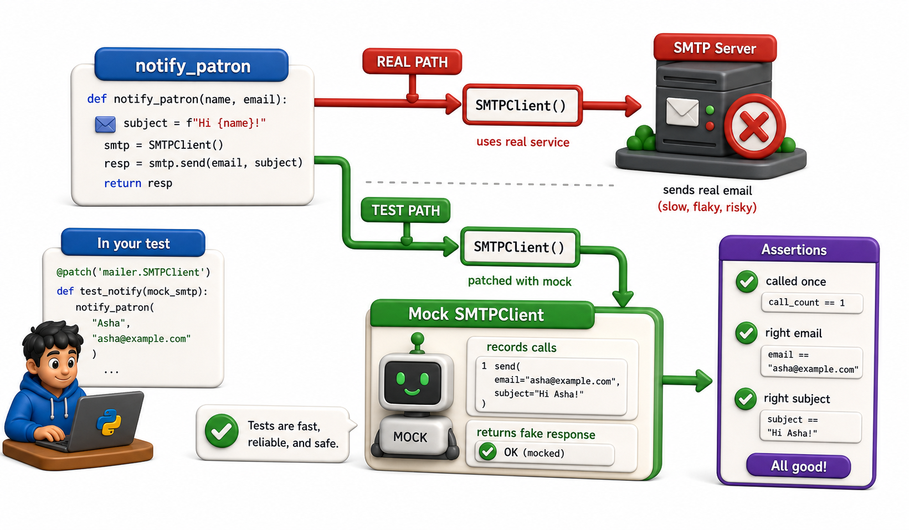

## Introduction

Sam's `notify_patron` function sends an email through an external SMTP server. When he tries to test it, the test actually sends an email to the patron's real address. Running the test suite fifty times a day means fifty spam emails to real people, plus a failing test every time the SMTP server is down for maintenance.

The solution is mocking: replacing the real external dependency with a controlled fake during testing. The fake behaves exactly as the real thing when told to, and records what calls were made to it, allowing the test to verify behavior without touching the external system.



## unittest.mock.MagicMock

Python's standard library includes `unittest.mock`. `MagicMock` is the core object: it accepts any attribute access or method call without raising an error, and records what was done to it.

```python
from unittest.mock import MagicMock

# MagicMock accepts any call
smtp = MagicMock()
smtp.sendmail("from@lib.org", "patron@mail.com", "Your book is due")

# Inspect what was called
print(smtp.sendmail.called)          # True
print(smtp.sendmail.call_count)      # 1
print(smtp.sendmail.call_args)       # call('from@lib.org', 'patron@mail.com', '...')

# Control the return value
smtp.login.return_value = True
result = smtp.login("user", "pass")
print(result)   # True
```

## patch: Replace at the Call Site

`unittest.mock.patch` temporarily replaces a name with a `MagicMock` for the duration of a test. The replacement is scoped: it reverts to the real object after the test exits.

```python
from unittest.mock import MagicMock, patch

# notify_patron uses smtplib.SMTP -- we mock it so no real network call is made
def notify_patron(patron_email, message, smtp_class=None):
    """Send an email via SMTP. smtp_class is injectable for testing."""
    import smtplib
    smtp_class = smtp_class or smtplib.SMTP
    with smtp_class("smtp.library.org", 587) as smtp:
        smtp.login("library", "secret")
        smtp.sendmail("library@library.org", patron_email, message)
        return True

def test_notify_patron_sends_email():
    mock_smtp_class = MagicMock()
    mock_instance = MagicMock()
    mock_smtp_class.return_value.__enter__ = MagicMock(return_value=mock_instance)
    mock_smtp_class.return_value.__exit__ = MagicMock(return_value=False)

    result = notify_patron("patron@mail.com", "Your book is due",
                           smtp_class=mock_smtp_class)

    assert result is True
    mock_instance.login.assert_called_once_with("library", "secret")
    mock_instance.sendmail.assert_called_once()
    print(f"  sendmail args: {mock_instance.sendmail.call_args}")

try:
    test_notify_patron_sends_email()
    print("PASS: test_notify_patron_sends_email")
except AssertionError as e:
    print("FAIL:", e)
```

The critical rule: patch where the name is *used*, not where it is defined. The function uses `smtplib.SMTP` as `library.notifications.smtplib.SMTP`, so that is what you patch.

## patch as a Decorator

`@patch` as a decorator is cleaner than the `with` form for test methods:

```python
from unittest.mock import MagicMock

def notify_patron(patron_email, message, smtp_class=None):
    import smtplib
    smtp_class = smtp_class or smtplib.SMTP
    with smtp_class("smtp.library.org", 587) as smtp:
        smtp.login("library", "secret")
        smtp.sendmail("library@library.org", patron_email, message)
        return True

def test_notify_sends_to_correct_address():
    # Arrange: create the mock smtp class and instance
    mock_smtp_class = MagicMock()
    mock_instance = MagicMock()
    mock_smtp_class.return_value.__enter__ = MagicMock(return_value=mock_instance)
    mock_smtp_class.return_value.__exit__ = MagicMock(return_value=False)

    # Act: call with the mock injected
    notify_patron("alice@mail.com", "Overdue notice", smtp_class=mock_smtp_class)

    # Assert: check the recipient
    args, _ = mock_instance.sendmail.call_args
    assert args[1] == "alice@mail.com", f"Expected alice@mail.com, got {args[1]}"

try:
    test_notify_sends_to_correct_address()
    print("PASS: test_notify_sends_to_correct_address")
except AssertionError as e:
    print("FAIL:", e)
```

The patched object is passed as the last argument to the test function.

## pytest-mock: A Cleaner pytest Integration

The `pytest-mock` plugin provides a `mocker` fixture that wraps `unittest.mock` with a cleaner API:

```console
pip install pytest-mock
```

```python
# pytest-mock provides a 'mocker' fixture -- shown here with MagicMock equivalent
# (in real pytest: def test_notify_with_mocker(mocker): mocker.patch(...))
from unittest.mock import MagicMock

def notify_patron(patron_email, message, smtp_class=None):
    import smtplib
    smtp_class = smtp_class or smtplib.SMTP
    with smtp_class("smtp.library.org", 587) as smtp:
        smtp.login("library", "secret")
        smtp.sendmail("library@library.org", patron_email, message)
        return True

def test_notify_with_mock():
    mock_smtp = MagicMock()
    instance = MagicMock()
    mock_smtp.return_value.__enter__ = MagicMock(return_value=instance)
    mock_smtp.return_value.__exit__ = MagicMock(return_value=False)

    notify_patron("alice@mail.com", "Overdue notice", smtp_class=mock_smtp)

    instance.sendmail.assert_called_once()
    print(f"  sendmail called {instance.sendmail.call_count} time(s)")

try:
    test_notify_with_mock()
    print("PASS: test_notify_with_mock")
except AssertionError as e:
    print("FAIL:", e)
```

`mocker.patch` automatically reverts after the test; no `with` block or decorator needed.

## Mock Assertions

Mocks provide built-in assertion methods:

```python
from unittest.mock import MagicMock

mock = MagicMock()
mock("arg1", "arg2")    # call it exactly once

mock.assert_called()                          # passes -- called at least once
print("assert_called(): passed")

mock.assert_called_once()                     # passes -- called exactly once
print("assert_called_once(): passed")

mock.assert_called_with("arg1", "arg2")       # passes -- last call used these args
print("assert_called_with('arg1', 'arg2'): passed")

mock.assert_called_once_with("arg1", "arg2") # passes -- called exactly once with these args
print("assert_called_once_with('arg1', 'arg2'): passed")

never_called = MagicMock()
never_called.assert_not_called()              # passes -- was never called
print("never_called.assert_not_called(): passed")
```

## What to Mock and What Not to

Mock external dependencies: network calls, database I/O, file system writes in slow tests, time (for deterministic date-sensitive tests). Do not mock the code you are actually testing.

```python
from unittest.mock import MagicMock

# GOOD: mock the external dependency, not the code you're actually testing
def notify_patron(patron_email, message, smtp_class=None):
    import smtplib
    smtp_class = smtp_class or smtplib.SMTP
    with smtp_class("smtp.library.org", 587) as smtp:
        smtp.login("library", "secret")
        smtp.sendmail("library@library.org", patron_email, message)
        return True

def test_notify_good():
    mock_smtp_class = MagicMock()
    mock_instance = MagicMock()
    mock_smtp_class.return_value.__enter__ = MagicMock(return_value=mock_instance)
    mock_smtp_class.return_value.__exit__ = MagicMock(return_value=False)
    result = notify_patron("patron@mail.com", "notice", smtp_class=mock_smtp_class)
    assert result is True
    mock_instance.sendmail.assert_called_once()

# BAD: mocking the thing you're testing defeats the purpose
class Catalog:
    def add(self, book):
        self._books = getattr(self, "_books", [])
        self._books.append(book)

def test_notify_bad():
    catalog = Catalog()
    mock_add = MagicMock()
    catalog.add = mock_add    # replacing the real add with a mock
    catalog.add("some book")
    mock_add.assert_called_once()   # this only proves the mock was called, not the real logic

try:
    test_notify_good()
    print("GOOD pattern: PASS")
    test_notify_bad()
    print("BAD pattern: PASS (but tests nothing real -- mocking what you test is pointless)")
except AssertionError as e:
    print("FAIL:", e)
```

## Mocking and Patching at a Glance

| Tool | What it does |
|---|---|
| `MagicMock()` | Fake object that accepts any call and records it |
| `mock.return_value = x` | Control what the mock returns |
| `patch("module.Name")` | Replace a name temporarily during the test |
| `mock.assert_called_once_with(args)` | Verify the mock was called with specific args |
| `mocker.patch(...)` | pytest-mock fixture version of patch |

## Your Turn

Write a test for a function `send_overdue_notices(overdue_records, notifier)` where `notifier` is a callable that sends the notification. Use a `MagicMock` as the notifier and verify it was called once per overdue record, with the correct patron ID:

```python
from unittest.mock import MagicMock

def send_overdue_notices(overdue_records, notifier):
    for record in overdue_records:
        notifier(record["patron_id"], f"Your book is {record['days_overdue']} days overdue.")

def test_sends_one_notice_per_record():
    mock_notifier = MagicMock()
    records = [
        {"patron_id": "P001", "days_overdue": 3},
        {"patron_id": "P002", "days_overdue": 7},
    ]
    send_overdue_notices(records, mock_notifier)

    assert mock_notifier.call_count == 2
    mock_notifier.assert_any_call("P001", "Your book is 3 days overdue.")
    mock_notifier.assert_any_call("P002", "Your book is 7 days overdue.")

# Run the tests:
try:
    test_sends_one_notice_per_record()
    print("PASS: test_sends_one_notice_per_record")
except AssertionError as e:
    print("FAIL:", e)
```

## Conclusion

Mocking replaces real external dependencies with controlled fakes, making tests fast, deterministic, and free of side effects. `MagicMock` is the fake object; `patch` targets the name where it is used in the module under test. Mock assertions verify that the code interacted with its dependencies in the expected way. The next lesson covers coverage: measuring how much of the code is actually being exercised by the test suite.
