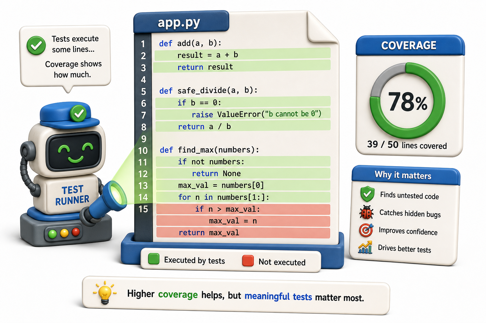

## Introduction

Sam's team lead asks a question he cannot answer: "What percentage of the code is covered by tests?" Sam knows his tests pass, but he does not know if there are entire code paths his tests never reach. The fine-calculation bug that caused the incident was in a branch of code that no test exercised, even though the main path was tested.

Coverage analysis answers the question by running the test suite and tracking which lines of code were executed. Any line not executed by any test is a gap that could hide a bug.



## Installing pytest-cov

Coverage for `pytest` is provided by the `pytest-cov` plugin, which wraps the `coverage.py` library:

```console
pip install pytest-cov
```

## Running Coverage

```console
# Run tests and measure coverage for the library/ package:
pytest --cov=library tests/

# Sample output:
# Name                     Stmts   Miss  Cover
# -------------------------------------------
# library/fines.py            12      2    83%
# library/catalog.py          31      5    84%
# library/notifications.py    18      8    56%
# -------------------------------------------
# TOTAL                       61     15    75%
```

The output shows: total statements in each file, how many were never executed, and the percentage covered.

## HTML Coverage Report

The terminal summary shows percentages but not which lines are missed. The HTML report shows the exact lines:

```console
pytest --cov=library --cov-report=html tests/
# Creates htmlcov/index.html
```

Open `htmlcov/index.html` in a browser. Each file shows lines in green (covered) and red (not covered). This is the most useful view for finding gaps.

## Reading Coverage: What It Tells You and What It Does Not

Coverage tells you which lines were executed. It does not tell you whether the behavior on those lines was correct. A test that calls a function but does not assert anything achieves 100% coverage without testing anything.

```python
def calculate_fine(days_overdue, daily_rate=0.50):
    if days_overdue < 0:
        raise ValueError("cannot be negative")
    return days_overdue * daily_rate

# This test covers all lines but tests nothing meaningful:
def test_calculate_fine():
    calculate_fine(10)   # line executed -- no assert
    # 100% coverage, 0% confidence

# Run the tests:
try:
    test_calculate_fine()
    print("PASS: test_calculate_fine")
except AssertionError as e:
    print("FAIL:", e)
```

Coverage is a lower bound on test quality, not an upper bound. 100% coverage with no assertions proves only that the code does not crash.

## Branch Coverage

Line coverage misses the case where a line is reached but a branch within it is not taken. `--cov-branch` enables branch coverage:

```console
pytest --cov=library --cov-branch tests/
```

For `if days_overdue < 0: raise ValueError(...)`, branch coverage requires both the `True` path (exception raised) and the `False` path (normal return) to be exercised.

## Setting a Coverage Target

Configure a minimum acceptable coverage in `pyproject.toml` so the CI build fails if coverage drops below the target:

```toml
# pyproject.toml
[tool.pytest.ini_options]
addopts = "--cov=library --cov-report=term-missing --cov-fail-under=80"
```

`--cov-fail-under=80` makes `pytest` exit with a failure code if total coverage drops below 80%. `--cov-report=term-missing` adds a "missing lines" column to the terminal output.

## What Lines Not to Worry About

Not every uncovered line is a problem. Lines in `if __name__ == "__main__":` blocks, defensive error handlers for truly impossible conditions, and abstract methods that are never instantiated directly are commonly excluded from coverage targets.

```python
# .coveragerc or pyproject.toml [tool.coverage.report]
[tool.coverage.report]
exclude_lines =
    pragma: no cover
    if __name__ == "__main__":
    raise NotImplementedError
print(exclude_lines)
```

Any line with `# pragma: no cover` is excluded from the report.

## Coverage at a Glance

| Command | What it does |
|---|---|
| `pytest --cov=pkg` | Measure coverage for a package |
| `pytest --cov-report=html` | Generate HTML report |
| `pytest --cov-branch` | Also measure branch coverage |
| `pytest --cov-fail-under=80` | Fail build below coverage threshold |
| `# pragma: no cover` | Exclude a line from the report |

## Your Turn

Run the coverage report on your test suite from this unit:

```console
pytest --cov=library --cov-branch --cov-report=term-missing tests/
```

Find two lines that are not covered and write tests that cover them. Then add a coverage target to `pyproject.toml` that requires 80% line coverage.

## Conclusion

Coverage shows which code lines and branches your tests reach. It is a lower bound on quality, not an upper bound: 100% coverage with no assertions proves nothing about correctness. Branch coverage is more thorough than line coverage. A CI-enforced minimum target prevents the test suite from degrading over time. The final lesson in this unit shows how test-driven development uses tests not as a verification step but as a design tool, written before the code they test.
