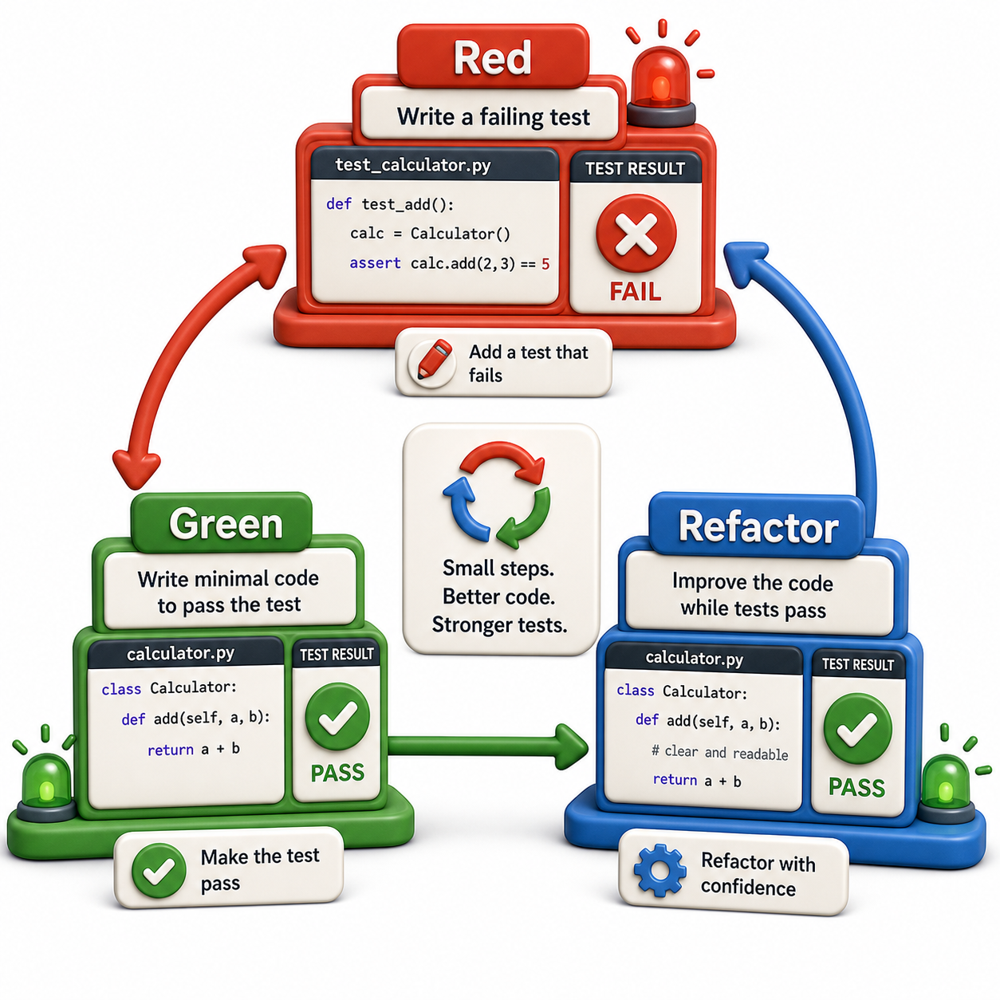

## Introduction

Sam's team lead makes a suggestion that sounds backwards: "Write the test before the function." Sam's instinct is that you cannot test code that does not exist yet. His lead explains that this is exactly the point: writing the test first forces you to design the function's interface before implementing it, and the failing test shows exactly what needs to be built.

This practice is called test-driven development (TDD). The workflow is three steps, run in a tight loop: Red (write a failing test), Green (write the minimum code to make it pass), Refactor (clean up the code while keeping the test green).



## The Red-Green-Refactor Cycle

**Red**: write a test for the function you want to build. Run it. It fails because the function does not exist yet. The failure is not a problem -- it is the goal of this step. A test that fails for the right reason confirms your test is correct.

**Green**: write the simplest code that makes the test pass. Do not optimize. Do not handle edge cases that are not yet tested. Just make it green.

**Refactor**: now that you have a passing test as a safety net, clean up the implementation. Extract duplication, rename variables, simplify logic. The test confirms you have not broken anything.

Repeat.

## A TDD Session: Building a Reservation System

**Step 1 -- Red**: Write a test for a function that does not yet exist.

```python
# tests/test_reservations.py
import pytest
from library.reservations import ReservationQueue

def test_empty_queue_has_zero_length():
    q = ReservationQueue()
    assert len(q) == 0

# Run the tests:
try:
    test_empty_queue_has_zero_length()
    print("PASS: test_empty_queue_has_zero_length")
except AssertionError as e:
    print("FAIL:", e)
```

Run `pytest`. It fails with `ModuleNotFoundError: No module named 'library.reservations'`. That is the expected red state.

**Step 2 -- Green**: Write the minimum code to pass the test.

```python
# library/reservations.py
class ReservationQueue:
    def __init__(self):
        self._queue = []

    def __len__(self):
        return len(self._queue)

# Demo:
obj = ReservationQueue()
print(obj)
```

Run `pytest`. The test passes. Green.

**Step 3 -- Refactor**: Nothing to clean up yet. Move to the next test.

---

**Step 4 -- Red**: Add a test for enqueuing a reservation.

```python
def test_add_reservation_increases_length():
    q = ReservationQueue()
    q.add("P001", "978-001")
    assert len(q) == 1

def test_add_two_reservations():
    q = ReservationQueue()
    q.add("P001", "978-001")
    q.add("P002", "978-001")
    assert len(q) == 2

# Run the tests:
try:
    test_add_reservation_increases_length()
    print("PASS: test_add_reservation_increases_length")
except AssertionError as e:
    print("FAIL:", e)
try:
    test_add_two_reservations()
    print("PASS: test_add_two_reservations")
except AssertionError as e:
    print("FAIL:", e)
```

Both tests fail. Green the first one:

```python
def add(self, patron_id, isbn):
    self._queue.append({"patron_id": patron_id, "isbn": isbn})

# Demo:
result = add(5, 5)
print(f"add(5, 5) ->", result)
```

Run `pytest`. Both tests now pass.

---

**Step 5 -- Red**: Test next-in-queue retrieval.

```python
def test_next_patron_is_first_added():
    q = ReservationQueue()
    q.add("P001", "978-001")
    q.add("P002", "978-001")
    assert q.next_patron() == "P001"

def test_next_patron_on_empty_raises():
    q = ReservationQueue()
    with pytest.raises(IndexError, match="no reservations"):
        q.next_patron()

# Run the tests:
try:
    test_next_patron_is_first_added()
    print("PASS: test_next_patron_is_first_added")
except AssertionError as e:
    print("FAIL:", e)
try:
    test_next_patron_on_empty_raises()
    print("PASS: test_next_patron_on_empty_raises")
except AssertionError as e:
    print("FAIL:", e)
```

**Step 6 -- Green**:

```python
def next_patron(self):
    if not self._queue:
        raise IndexError("no reservations")
    return self._queue[0]["patron_id"]

# Demo:
result = next_patron()
print(f"next_patron() ->", result)
```

Tests pass.

**Step 7 -- Refactor**: Change `self._queue` to a `collections.deque` for O(1) access from both ends, then verify all tests still pass.

## Why TDD Helps Design

TDD naturally produces functions with clean interfaces:

- You write the test from the perspective of the caller, which forces you to think about the API before the implementation.
- You cannot write a test for a function that is hard to call, so TDD creates pressure toward smaller, focused functions.
- Every function you write has tests from the start, so coverage stays high automatically.

## When TDD Is and Is Not Appropriate

TDD works well for: business logic with clear inputs and outputs (fine calculations, queuing, validation), algorithmic functions, anything where the specification is clear.

TDD is harder for: UI code, exploratory prototypes where the requirements are unclear, integration code that wires together external systems.

## TDD Workflow at a Glance

| Phase | Goal |
|---|---|
| Red | Write a failing test that describes what you want |
| Green | Write the minimum code to make it pass |
| Refactor | Clean up with the test as a safety net |
| Repeat | Next test, next cycle |

## Your Turn

Build a `WaitList` class using TDD. Start with these tests in order (add one at a time, make it pass before adding the next):

1. `test_empty_waitlist_length` -- `len(WaitList())` is 0
2. `test_add_patron_to_waitlist` -- after `wl.add("P001")`, length is 1
3. `test_serve_removes_first_added` -- `wl.serve()` returns the patron added first (FIFO)
4. `test_serve_decreases_length` -- length drops by 1 after `wl.serve()`
5. `test_serve_empty_raises` -- `wl.serve()` raises `IndexError` on empty list

Work one test at a time. Do not write code that is not yet required by a test.

## Conclusion

TDD writes tests before code, using the Red-Green-Refactor cycle to drive implementation from the outside in. It produces functions with clean, testable interfaces and keeps coverage high by construction. It is not always the right approach for exploratory work, but for any well-defined piece of business logic, it is the most reliable path to code that works correctly from the start. Unit 9 moves from testing to code quality: type hints, linters, formatters, and pre-commit hooks that catch problems before the tests even run.
