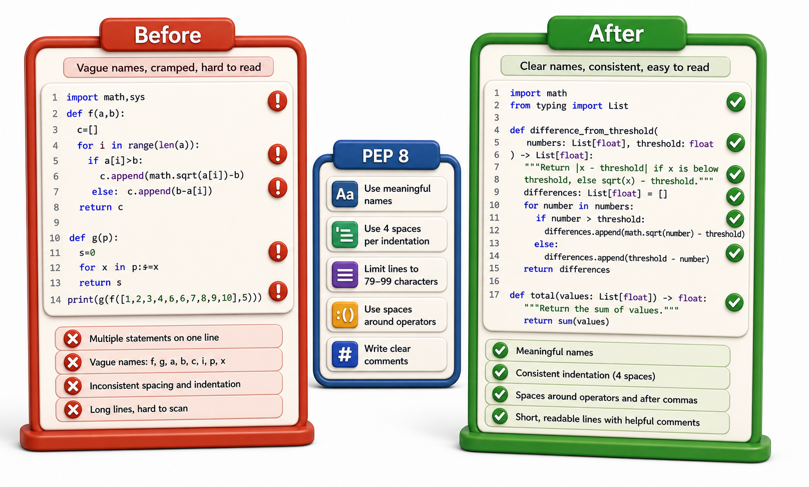

## Introduction

Raj joined the library consortium's engineering team six months ago. In every code review, the same comment threads appear: "this variable name is too short," "this line is 110 characters wide," "add a blank line before this function." His team wastes an hour each sprint debating style in reviews instead of discussing design.

His proposal: agree on a style standard, enforce it automatically, and stop discussing it in reviews. The starting point is PEP 8, Python's official style guide, and the first question is: what does it actually say and why?



## What PEP 8 Is

PEP 8 is the Style Guide for Python Code, written by Guido van Rossum and published as a Python Enhancement Proposal. It covers naming, whitespace, imports, and line length. Most Python projects follow it, which means any Python developer can read any PEP 8-compliant codebase without adjusting to a personal style.

The most important rule in PEP 8: "A Foolish Consistency is the Hobgoblin of Little Minds." The guide is not the law. Deviation is acceptable when it makes the code clearer. But within a project, consistency matters more than any single rule.

## Naming Conventions

```python
# Variables and functions: lowercase_with_underscores (snake_case)
book_count = 0
max_loan_days = 21

def calculate_fine(days_overdue, daily_rate=0.50):
    return days_overdue * daily_rate

# Classes: CapWords (PascalCase)
class LibraryItem:
    pass

class EBookCatalog:
    pass

# Constants: ALL_CAPS_WITH_UNDERSCORES
MAX_LOAN_PERIOD_DAYS = 21
DEFAULT_FINE_RATE = 0.50

# Private / internal: single leading underscore
class Book:
    def __init__(self):
        self._copies = 0        # protected: convention only
        self.__checksum = ""    # private: name-mangled

# Dunder methods: double leading and trailing underscores
def __repr__(self):
    return f"Book({self.isbn!r})"

# Demo:
result = calculate_fine(5, 5)
print(f"calculate_fine(5, 5) ->", result)
```

## Whitespace

```python
# Setup values for the whitespace examples below
days_overdue, daily_rate = 5, 0.50
a, b = 10, 3
days, rate = 7, 0.50
books = list(range(10))

def calculate_fine(days, rate=0.50):
    return days * rate

# Good: spaces around operators
result = days_overdue * daily_rate
total = a + b
print(f"result={result}, total={total}")

# Bad: no spaces (runs, but PEP 8 discourages it)
result=days_overdue*daily_rate

# Good: no space before the colon in slices and function calls
print(books[1:5])
print(calculate_fine(days, rate=0.50))

# Bad: extra spaces (same output, poor style)
print(books[1:5])
print(calculate_fine( days , rate = 0.50 ))

# Good: blank lines to separate logical sections
class Catalog:

    def __init__(self):
        self._books = []

    def add(self, book):
        self._books.append(book)

    def find(self, isbn):
        return next((b for b in self._books if b.isbn == isbn), None)

# Demo:
obj = Catalog()
print(obj)
```

## Line Length

PEP 8 recommends a maximum of 79 characters per line (72 for docstrings). Many teams use 88 or 100 characters, which is the `black` formatter's default. The principle is: keep lines short enough that two files can be opened side by side.

```python
def calculate_overdue_fine(days_overdue, daily_rate):
    return days_overdue * daily_rate

record = {"days_overdue": 14}
config = {"fine_rate_per_day": 0.50}

# Too long (one line, hard to read at a glance):
result = calculate_overdue_fine(days_overdue=record["days_overdue"], daily_rate=config["fine_rate_per_day"])
print(f"One-liner result: {result}")

# Better: break at a natural point (PEP 8 style)
result = calculate_overdue_fine(
    days_overdue=record["days_overdue"],
    daily_rate=config["fine_rate_per_day"]
)
print(f"Multi-line result: {result}")
```

## Import Order

```python
# PEP 8 import order: stdlib -> third-party -> local (each group separated by a blank line)
import os
import sys
from pathlib import Path
# (blank line separates stdlib from third-party)
# import pytest           # third-party
# import requests         # third-party
# (blank line separates third-party from local)
# from library.catalog import Catalog  # local
# from library.fines import calculate_fine  # local

# Show the rule visually:
import_groups = [
    ("stdlib",       ["os", "sys", "pathlib.Path", "json", "datetime"]),
    ("third-party",  ["pytest", "requests", "sqlalchemy"]),
    ("local",        ["library.catalog", "library.fines"]),
]
for group, modules in import_groups:
    print(f"# --- {group} ---")
    for m in modules:
        print(f"import {m}")
    print()
```

The `ruff` and `isort` tools enforce this order automatically.

## What PEP 8 Does Not Cover

PEP 8 does not cover variable naming quality (only style), function length, complexity, or architecture. A variable named `x` with an underscore is PEP 8-compliant but incomprehensible. "Clean code" goes beyond style:

- Functions do one thing
- Names describe intent: `days_overdue` not `d`, `patron_id` not `pid`
- Functions are short enough to read without scrolling
- Logic is expressed directly, not obscured by complexity

```python
# PEP 8-compliant but poor:
def f(d, r):
    return d * r

# PEP 8-compliant and clear:
def calculate_fine(days_overdue, daily_rate=0.50):
    return days_overdue * daily_rate

# Demo: same calculation, very different readability
result_obscure = f(7, 0.50)
result_clear = calculate_fine(7, 0.50)
print(f"f(7, 0.50)                      -> {result_obscure}")
print(f"calculate_fine(7, daily_rate=0.50) -> {result_clear}")
print("Both return the same value; only one tells you why.")
```

## PEP 8 / Clean Code at a Glance

| Rule | Convention |
|---|---|
| Variables, functions | `snake_case` |
| Classes | `PascalCase` |
| Constants | `ALL_CAPS` |
| Max line length | 79 (PEP 8) or 88 (black) |
| Import order | stdlib, third-party, local |
| Blank lines | 2 between top-level, 1 inside class |

## Your Turn

Open any Python file you have written and apply PEP 8 manually:
1. Rename any single-letter variables (except loop counters) to descriptive names
2. Confirm function names use `snake_case` and class names use `PascalCase`
3. Check that imports are grouped and ordered correctly
4. Find any line longer than 88 characters and break it at a natural point

Then run `python -m pep8 yourfile.py` or the next lesson's tool to confirm automatically.

## Conclusion

PEP 8 provides naming, whitespace, and import conventions that make Python code consistent and readable to any Python developer. Clean code goes beyond style to include naming quality, function focus, and simplicity. The next lesson introduces type hints and `mypy`, which catch entire classes of bugs that PEP 8 cannot: passing the wrong type to a function.
