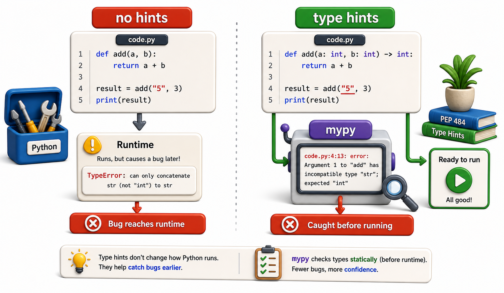

## Introduction

Raj's library system had a bug last month: a function that expected an integer number of days was passed the string `"14"` from a form input. The multiplication `"14" * 0.50` returned `"1414141414141414141414141414"` -- a 28-character string -- because Python's `*` operator repeats strings. No error was raised. The bug silently produced wrong output for days before anyone noticed.

Type hints would have caught this at analysis time. `mypy` would have flagged the function call as incorrect before the code ever ran.



## What Type Hints Are

Type hints are optional annotations that describe what type a variable, parameter, or return value should be. Python itself ignores them at runtime -- they are metadata. Tools like `mypy` read the annotations and flag type mismatches.

```python
# Without type hints: Python accepts any type silently
def calculate_fine(days_overdue, daily_rate=0.50):
    return days_overdue * daily_rate

# With type hints: intent is explicit, mypy can verify callers
def calculate_fine(days_overdue: int, daily_rate: float = 0.50) -> float:
    return days_overdue * daily_rate

# Type hints on variables
book_count: int = 0
isbn: str = "978-001"
catalog: list[str] = []

# Demo:
result = calculate_fine(5, 5)
print(f"calculate_fine(5, 5) ->", result)
result = calculate_fine(5, 5)
print(f"calculate_fine(5, 5) ->", result)
```

## Built-in Types in Annotations

```python
def find_book(isbn: str, catalog: list) -> dict | None:
    for book in catalog:
        if book["isbn"] == isbn:
            return book
    return None

# Demo:
catalog = [{"isbn": "978-001", "title": "Dune"}, {"isbn": "978-002", "title": "Foundation"}]
result = find_book("978-001", catalog)
print(f"find_book('978-001', catalog) -> {result}")
```

From Python 3.10+, `X | Y` means "either X or Y". In Python 3.9, use `Optional[X]` from the `typing` module for nullable types. In Python 3.8, use `Union[X, Y]`.

```python
# Python 3.10+
def find(isbn: str) -> dict | None: ...

# Python 3.9 and earlier
from typing import Optional, Union
def find(isbn: str) -> Optional[dict]: ...

# Demo:
result = find(5)
print(f"find(5) ->", result)
result = find(5)
print(f"find(5) ->", result)
```

## Complex Types

```python
from typing import Callable

# List of strings
def process(titles: list[str]) -> None: ...

# Dictionary mapping string to int
def get_counts() -> dict[str, int]: ...

# Tuple of fixed types
def get_location() -> tuple[float, float]: ...

# A callable that takes an int and returns a float
def apply(fn: Callable[[int], float], value: int) -> float:
    return fn(value)

# Demo:
result = process(["Dune", "Foundation", "1984"])
print(f"process(['Dune', 'Foundation', '1984']) -> {result}")
result = get_counts()
print(f"get_counts() -> {result}")
```

## Installing and Running mypy

```console
pip install mypy
mypy library/fines.py
```

Sample output when a type error exists:

```
library/fines.py:12: error: Argument 1 to "calculate_fine" has incompatible type "str"; expected "int"
Found 1 error in 1 file (checked 1 source file)
```

`mypy` reads the type annotations and checks every call site. If a function annotated `-> float` is passed `"14"` where an `int` is expected, it flags the call.

## Gradual Typing

You do not need to annotate everything at once. `mypy` checks only the files and functions it can analyze. Start with the most critical modules:

```python
# Fully annotated -- mypy checks everything
def reserve(isbn: str, patron_id: str, days: int) -> bool:
    ...

# Partially annotated -- mypy checks only the annotated parts
def reserve(isbn, patron_id, days: int):
    ...

# Unannotated -- mypy skips this function
def reserve(isbn, patron_id, days):
    ...

# Demo:
result = reserve(5, 5, 5)
print(f"reserve(5, 5, 5) ->", result)
result = reserve(5, 5, 5)
print(f"reserve(5, 5, 5) ->", result)
```

A `py.typed` marker file in the package root tells `mypy` that the package has complete type annotations and should be fully checked.

## dataclasses and TypedDict

For structured data, type hints combine cleanly with `@dataclass`:

```python
from dataclasses import dataclass

@dataclass
class Book:
    isbn: str
    title: str
    genre: str
    copies: int

    def is_available(self) -> bool:
        return self.copies > 0

# Demo:
obj = Book()
print(obj)
```

Every field has an explicit type. `mypy` catches `book.copies = "three"` as a type error.

`TypedDict` is useful for dictionaries with known keys:

```python
from typing import TypedDict

class BorrowRecord(TypedDict):
    isbn: str
    patron_id: str
    borrow_date: str
    loan_days: int

# Demo:
obj = BorrowRecord()
print(obj)
```

## Type Hints and mypy at a Glance

| Syntax | Meaning |
|---|---|
| `x: int` | x should be an int |
| `x: str \| None` | x is a string or None |
| `-> float` | function returns a float |
| `list[str]` | list whose elements are strings |
| `dict[str, int]` | dict mapping string keys to int values |
| `Callable[[int], float]` | callable taking int, returning float |

## Your Turn

Add type hints to these three functions from earlier units:

```python
from datetime import date, timedelta

def overdue_report(records, today=None):
    today = today or date.today()
    overdue = []
    for record in records:
        borrow = date.fromisoformat(record["borrow_date"])
        due = borrow + timedelta(days=record["loan_days"])
        if today > due:
            overdue.append({**record, "days_overdue": (today - due).days})
    return overdue

def calculate_fine(days_overdue, daily_rate=0.50):
    if days_overdue < 0:
        raise ValueError("cannot be negative")
    return days_overdue * daily_rate

def find_book(isbn, catalog):
    return next((b for b in catalog if b.isbn == isbn), None)

# Demo:
result = overdue_report([1, 2, 3], "test")
print(f"overdue_report([1, 2, 3], "test") ->", result)
result = calculate_fine(5, 5)
print(f"calculate_fine(5, 5) ->", result)
```

After annotating, run `mypy` and fix any errors it finds.

## Conclusion

Type hints describe expected types; `mypy` checks that callers respect them. Python does not enforce type hints at runtime, but `mypy` catches mismatches statically, before the code runs. The next lesson adds the next layer of automated checking: `ruff`, a linter that enforces PEP 8 style rules and catches common logic errors, faster than any human code reviewer.
