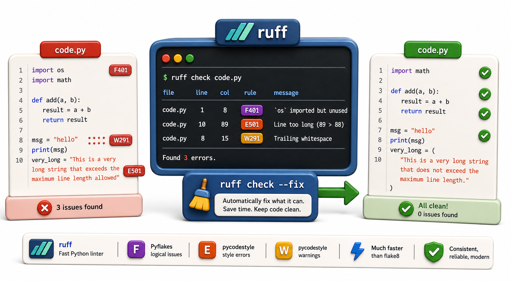

## Introduction

Raj's team has agreed on PEP 8, but enforcing it manually in code reviews is tedious and inconsistent. Different reviewers catch different issues. The same reviewer catches different things on Monday and Friday. What the team needs is a tool that checks style rules the same way every time, in milliseconds.

That tool is a linter. `ruff` is the modern choice: it is written in Rust and is 10-100x faster than its predecessor `flake8`, while covering a superset of `flake8`'s rules. This lesson covers how to use `ruff` to find and fix style issues automatically.



## Installing and Running ruff

```console
pip install ruff

# Check all Python files in the project:
ruff check .

# Check a specific file:
ruff check library/fines.py

# Auto-fix fixable issues:
ruff check --fix .
```

Sample output:

```
library/fines.py:3:1: F401 `os` imported but unused
library/catalog.py:22:89: E501 Line too long (92 > 88 characters)
library/notifications.py:7:1: F841 Local variable `conn` is assigned to but never used
Found 3 errors.
[*] 1 fixable with the `--fix` option.
```

## Rule Codes

`ruff` organizes rules into named groups. Each violation has a code like `E501` or `F401`:

| Prefix | Category | Examples |
|---|---|---|
| `E` | Style errors (PEP 8) | `E501` line too long, `E302` missing blank lines |
| `W` | Style warnings | `W291` trailing whitespace |
| `F` | Pyflakes (logic issues) | `F401` unused import, `F841` unused variable, `F821` undefined name |
| `I` | Import sorting (isort) | `I001` imports not sorted |
| `N` | Naming conventions | `N802` function name should be lowercase |
| `UP` | Pyupgrade (modern Python) | `UP007` use `X \| Y` instead of `Union[X, Y]` |

## Configuring ruff

Configuration lives in `pyproject.toml`:

```toml
[tool.ruff]
line-length = 88
target-version = "py311"

[tool.ruff.lint]
select = ["E", "F", "W", "I", "N", "UP"]   # which rule groups to enable
ignore = ["E501"]                            # ignore line-too-long (let black handle it)
```

## Ignoring Specific Lines

When a violation is intentional, annotate the line:

```python
import os   # noqa: F401 -- ruff/flake8 would normally flag this as "unused import"
import sys  # this one IS used, so no noqa needed

# Show what noqa does conceptually:
noqa_examples = [
    ("import os  # noqa: F401",      "suppress F401 (unused import) on this line"),
    ("x = 1  # noqa: F841",          "suppress F841 (unused variable) on this line"),
    ("very_long_line  # noqa: E501", "suppress E501 (line too long) on this line"),
    ("import *  # noqa",             "suppress ALL warnings on this line (avoid this)"),
]
print("noqa usage examples:")
for code, explanation in noqa_examples:
    print(f"  {code}")
    print(f"    -> {explanation}")

print(f"\nCurrent Python version (using sys): {sys.version_info.major}.{sys.version_info.minor}")
```

`noqa` (no quality assurance) tells the linter to skip that line. Overuse of `noqa` defeats the purpose; use it only for genuine exceptions.

## ruff vs flake8

`ruff` is a drop-in replacement for `flake8` in almost all cases. It also replaces `isort` (import sorting), `pyupgrade` (modern syntax), and several other plugins. The main reasons to choose `ruff` over `flake8`:

- `ruff` is 10-100x faster (written in Rust; an entire repo checks in milliseconds)
- `ruff check --fix` auto-fixes many issues
- One tool replaces several plugins

`flake8` remains widely used in existing projects because it has a large plugin ecosystem. Both follow the same rule numbering scheme.

## Running as Part of a Git Workflow

Raj's goal is to run `ruff` automatically before every commit, so style violations are caught locally before they reach CI. The next lessons cover `pre-commit` hooks which make this happen.

For now, running manually confirms the tool is working:

```console
# Check and auto-fix
ruff check --fix .

# Show remaining unfixable issues
ruff check .
```

## ruff / Linting at a Glance

| Command | What it does |
|---|---|
| `ruff check .` | Check all Python files for violations |
| `ruff check --fix .` | Fix auto-fixable violations |
| `ruff check file.py` | Check one file |
| `# noqa: CODE` | Suppress a specific warning on one line |
| `pyproject.toml [tool.ruff.lint]` | Configure selected rules and ignores |

## Your Turn

Install `ruff` and run it on a Python project from this semester. Examine the first five violations it finds and categorize them by prefix (E, F, W, I, N). For each one:
1. Read the rule description (`ruff rule E501` prints it)
2. Decide whether to fix it, configure it away, or suppress it with `noqa`

Then add a `[tool.ruff.lint]` section to `pyproject.toml` with your team's agreed rule set.

```console
# Install and check
pip install ruff
ruff check .

# Look up a specific rule:
ruff rule F401
# Outputs: F401: `{name}` imported but unused ...
```

## Conclusion

`ruff` is a fast linter that catches PEP 8 style issues, unused imports, undefined variables, and sorting problems in milliseconds. It auto-fixes many violations. Configuration lives in `pyproject.toml`. The next lesson adds the final automated style tool: `black`, the opinionated code formatter that enforces consistent style by rewriting code, not just flagging it.
