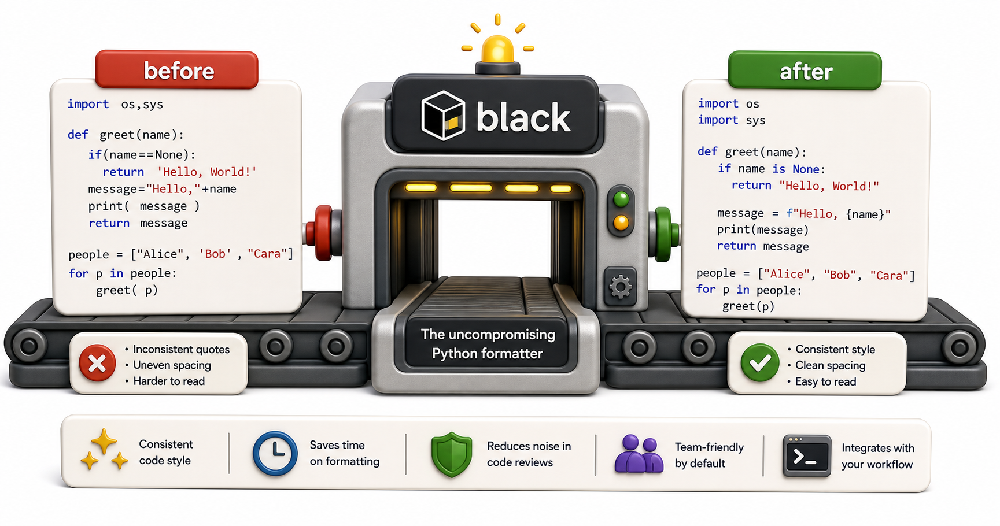

## Introduction

Even with `ruff` checking style, Raj's team still argues about formatting in code reviews: single quotes or double quotes? Trailing commas or not? How to break a long function call across lines? These are not bugs -- they are preference, and debating preferences in reviews is a waste of time.

`black` is "The Uncompromising Code Formatter." It makes exactly one formatting choice for each situation and applies it consistently. You do not configure it (much). You just run it. Code review debates about formatting become impossible because `black` has already decided.



## Installing and Running black

```console
pip install black

# Format all Python files in the project:
black .

# Format a specific file:
black library/fines.py

# Check without modifying (exit code 1 if changes would be made):
black --check .

# Show what would change without modifying:
black --diff .
```

`black .` reformats files in place. `black --check .` is used in CI pipelines to verify that committed code is already formatted.

## What black Does

`black` makes consistent, opinionated choices:

```python
# Before black: inconsistent style
def calculate_fine(days_overdue,daily_rate = 0.50, max_fine=None ):
    if max_fine and days_overdue*daily_rate > max_fine:
        return max_fine
    else:
        return days_overdue*daily_rate

# After black: consistent, no debates needed
def calculate_fine(days_overdue, daily_rate=0.50, max_fine=None):
    if max_fine and days_overdue * daily_rate > max_fine:
        return max_fine
    else:
        return days_overdue * daily_rate

# Demo:
result = calculate_fine(5, 5, 5)
print(f"calculate_fine(5, 5, 5) ->", result)
result = calculate_fine(5, 5, 5)
print(f"calculate_fine(5, 5, 5) ->", result)
```

Key choices `black` makes:
- Double quotes for all strings (configurable only to single)
- Spaces around binary operators
- No space before `=` in keyword arguments
- Trailing comma after the last element in a multi-line collection
- 88-character line length by default
- Long expressions broken consistently at a magic trailing comma

## The Magic Trailing Comma

If you add a trailing comma after the last element in a collection or function call, `black` treats it as a signal to keep the structure expanded across multiple lines, even if it fits on one line:

```python
# Without trailing comma: black may collapse to one line
books = ["Dune", "Foundation", "Neuromancer"]

# With trailing comma: black keeps it expanded
books = [
    "Dune",
    "Foundation",
    "Neuromancer",  # trailing comma -- black keeps this expanded
]

# Same for function calls:
def notify_patron(patron_email, message, urgent=False):
    print(f"Notifying {patron_email}: {message} (urgent={urgent})")

notify_patron(
    patron_email="alice@mail.com",
    message="Your book is overdue",
    urgent=True,   # trailing comma signals "keep expanded"
)
print(books)
```

## Configuring black

`black` has very few configuration options. The most common is line length:

```toml
# pyproject.toml
[tool.black]
line-length = 88
target-version = ["py311"]
```

Leave `line-length` at 88 unless there is a project-specific reason to change it. Using the default means `black` and `ruff`'s `E501` check agree on the maximum.

## black vs. Manual Formatting

The philosophy of `black` is: consistency over preference. You may not like every formatting choice it makes. That is expected. The trade-off is: you spend zero time debating formatting, and every developer's code looks the same after formatting. For most teams, this is a net gain.

The one thing `black` does not do: rename variables or restructure logic. It only changes whitespace and quotes. Style and logic are separate concerns.

## Integrating black with ruff

`ruff` includes formatting rules that overlap with `black`. The standard integration is to run `black` for formatting and `ruff` for linting, and disable `ruff`'s format-overlap rules:

```toml
[tool.ruff.lint]
# Disable rules that black handles (formatting)
extend-ignore = ["E501", "W503"]
```

Alternatively, `ruff format` (introduced in ruff 0.1.0+) is a `black`-compatible formatter. Check your team's tool version to decide which to use.

## black at a Glance

| Command | What it does |
|---|---|
| `black .` | Format all files in place |
| `black --check .` | Fail if any file would change (for CI) |
| `black --diff .` | Show diffs without modifying |
| `# fmt: off` / `# fmt: on` | Disable black for a section |

## Your Turn

Run `black --diff library/` on the library project. Read the diff output and identify three formatting changes `black` would make. Then run `black library/` to apply them. Confirm the code still runs correctly and all tests still pass.

```console
# See what would change:
black --diff library/

# Apply the changes:
black library/

# Verify nothing broke:
pytest
```

## Conclusion

`black` ends formatting debates by making consistent, non-negotiable choices. Run it before committing or in CI with `--check`. The next lesson introduces git hooks, the mechanism that runs tools like `ruff` and `black` automatically at commit time, before any code reaches the shared repository.
