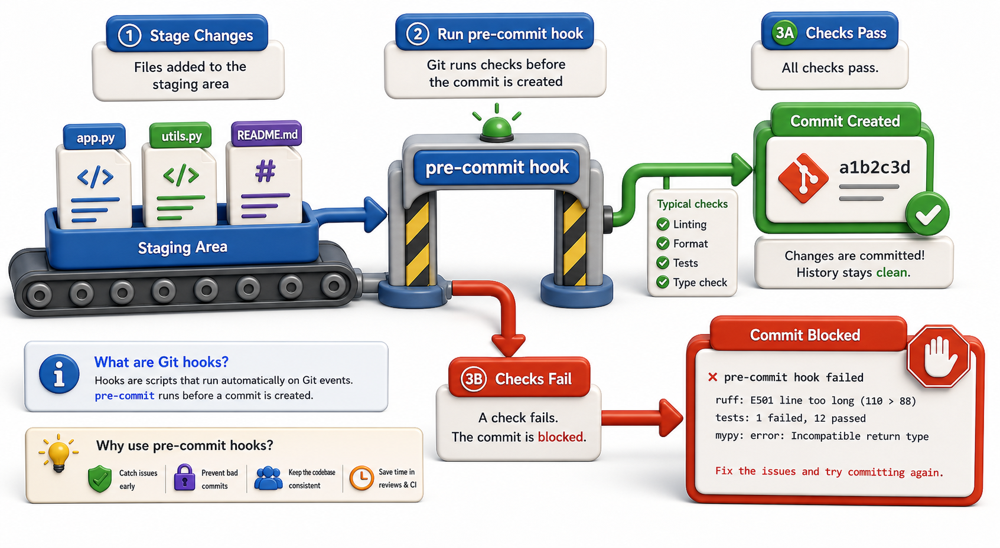

## Introduction

Raj can now run `ruff`, `black`, and `mypy` individually. The problem is that developers forget to run them before committing. Style issues still reach the shared repository and show up in CI failures, which are slower to catch and more disruptive to fix than catching them locally.

Git hooks solve this: they are scripts that Git runs automatically at specific points in the workflow. A `pre-commit` hook runs before every commit. If the hook fails (exits with a non-zero code), Git cancels the commit. The developer sees the failure immediately, fixes it, and commits again.



## Where Git Hooks Live

Git hooks are shell scripts stored in `.git/hooks/`. Git creates sample hooks with a `.sample` extension when you run `git init`. To activate a hook, remove the `.sample` extension and make the file executable.

```console
ls .git/hooks/
# applypatch-msg.sample  pre-commit.sample  pre-push.sample  ...
```

The most commonly used hooks:
- `pre-commit`: runs before a commit is created
- `commit-msg`: validates the commit message format
- `pre-push`: runs before a push to a remote
- `post-merge`: runs after a merge completes (e.g., to install new dependencies)

## A Simple pre-commit Hook

```console
# .git/hooks/pre-commit
#!/bin/sh
# Run ruff linter; if it fails, abort the commit

ruff check .
exit $?   # pass through ruff's exit code
```

Make it executable:
```console
chmod +x .git/hooks/pre-commit
```

Now every `git commit` runs `ruff check .` first. If `ruff` finds any violations, it exits with code 1, Git sees the failure, and the commit is aborted.

## A Hook That Checks and Auto-Fixes

```console
#!/bin/sh
# Auto-fix with ruff, auto-format with black, then re-stage the changes

ruff check --fix . && black .

# Re-stage the modified files so the changes are included in the commit
git add -u

# Exit 0 to allow the commit to proceed
exit 0
```

This hook runs `ruff --fix` and `black`, re-stages the files, and lets the commit proceed. The developer does not need to manually fix and re-commit.

## Limitations of Manual Hooks

Manual hooks have two problems:

1. They live in `.git/hooks/`, which is not version-controlled. Every developer who clones the repository must set up hooks themselves. If the team grows to ten people, all ten must remember to install and update the hooks.

2. Different developers can configure different hooks, leading to inconsistency.

The `pre-commit` framework (next lesson) solves both problems by version-controlling the hook configuration and managing hook installation automatically.

## Hook Types Reference

| Hook | When it runs |
|---|---|
| `pre-commit` | Before a commit is created (after staging) |
| `commit-msg` | After the commit message is written, before commit |
| `pre-push` | Before pushing to a remote |
| `post-commit` | After a commit is created (cannot abort) |
| `post-merge` | After a merge finishes |
| `pre-rebase` | Before a rebase starts |

## Bypassing Hooks (and When Not To)

```console
git commit --no-verify   # skip all hooks for this commit
```

`--no-verify` is available but should be used only for genuine emergencies (hot-fix in an incident, debugging the hook itself). Normalizing its use defeats the purpose of having hooks.

## Git Hooks at a Glance

| Concept | What it means |
|---|---|
| Hook location | `.git/hooks/` (not version-controlled) |
| Activation | Remove `.sample` extension, make executable |
| `pre-commit` | Most important: runs before every commit |
| Exit code 0 | Hook passes, commit proceeds |
| Exit code non-zero | Hook fails, commit aborted |
| `--no-verify` | Skip hooks (use sparingly) |

## Your Turn

Create a `pre-commit` hook in your library project that:
1. Runs `ruff check .` and exits 1 if there are violations
2. Runs `black --check .` and exits 1 if formatting is needed

Test it by introducing a deliberate style violation (an unused import, a line over 88 characters) and confirming that `git commit` is blocked. Then fix the violation and confirm the commit succeeds.

```console
#!/bin/sh
ruff check . || exit 1
black --check . || exit 1
exit 0
```

## Conclusion

Git hooks are shell scripts that run at specific points in the Git workflow. `pre-commit` hooks enforce quality gates before code enters the repository. They are powerful but require every developer to install them manually, since `.git/hooks/` is not version-controlled. The next lesson introduces the `pre-commit` framework, which solves this by defining hooks in a committed configuration file that manages itself.
