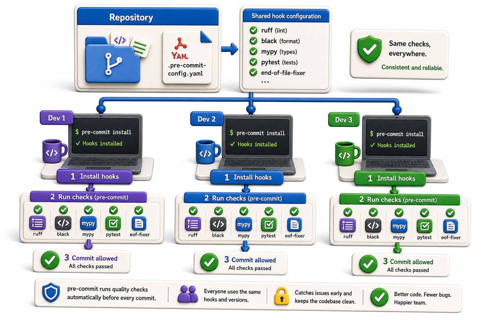

## Introduction

Raj shares the `pre-commit` hook script with his team. Two weeks later, a colleague pushes a commit with a long line of dead code. It turns out she never installed the hook. The `.git/hooks/` directory is not tracked by git, so the hook only exists on Raj's machine.

The `pre-commit` framework solves this with a single committed configuration file: `.pre-commit-config.yaml`. It defines which hooks to run, where to download them from, and which version to use. Any developer who runs `pre-commit install` gets the exact same hooks.



## Installing the pre-commit Framework

```console
pip install pre-commit
```

## Creating .pre-commit-config.yaml

The configuration file lives at the project root and is committed to the repository:

```yaml
# .pre-commit-config.yaml
repos:
  - repo: https://github.com/astral-sh/ruff-pre-commit
    rev: v0.4.4      # pin to a specific version
    hooks:
      - id: ruff
        args: [--fix]
      - id: ruff-format   # ruff's black-compatible formatter

  - repo: https://github.com/pre-commit/pre-commit-hooks
    rev: v4.6.0
    hooks:
      - id: trailing-whitespace
      - id: end-of-file-fixer
      - id: check-yaml
      - id: check-merge-conflict
```

## Installing Hooks for Developers

After cloning the repository, each developer runs:

```console
pre-commit install
```

This installs the hooks into `.git/hooks/pre-commit` (and other hook types if configured). Now every `git commit` runs the configured hooks automatically.

## Running Manually

```console
# Run all hooks on all files (not just staged files):
pre-commit run --all-files

# Run a specific hook:
pre-commit run ruff

# Run on staged files only (same as commit-time):
pre-commit run
```

`pre-commit run --all-files` is useful when first adding hooks to a project: it finds all existing violations at once.

## What Happens on a Commit

When a developer runs `git commit`:

1. `pre-commit` identifies the staged files
2. It runs each configured hook against those files
3. If a hook modifies files (e.g., `ruff --fix` removes unused imports), the files are modified but NOT re-staged automatically
4. Git shows "hook modified files" and aborts the commit
5. The developer runs `git add` to re-stage the changed files and commits again

Some teams configure hooks to auto-stage fixes with `always_run: true` and a `git add` step, but the default behavior (fail on modification) is safer.

## Keeping Hooks Updated

Hook versions are pinned in the config file. To update them to the latest versions:

```console
pre-commit autoupdate
```

This updates the `rev` field in `.pre-commit-config.yaml` to the latest tagged version for each repo. Commit the updated file so all developers get the same version.

## The pre-commit Framework at a Glance

| Command | What it does |
|---|---|
| `pre-commit install` | Install hooks from `.pre-commit-config.yaml` |
| `pre-commit run --all-files` | Run all hooks on all files |
| `pre-commit run ruff` | Run one specific hook |
| `pre-commit autoupdate` | Update hook versions in config |
| `.pre-commit-config.yaml` | Version-controlled hook configuration |

## Your Turn

Initialize the `pre-commit` framework in your library project:

```console
pip install pre-commit
```

Create `.pre-commit-config.yaml` with at least two hooks from the examples above. Then run:

```console
pre-commit install
pre-commit run --all-files
```

Fix any issues found, commit the `.pre-commit-config.yaml` file, and test that the hooks run automatically on your next `git commit`.

## Conclusion

The `pre-commit` framework version-controls hook configuration, ensuring every developer gets the same hooks with the same settings. `pre-commit install` sets up hooks locally; `pre-commit run --all-files` finds all existing violations; `pre-commit autoupdate` keeps hook versions current. The next lesson shows how to configure these hooks in detail and add project-specific checks like mypy.
