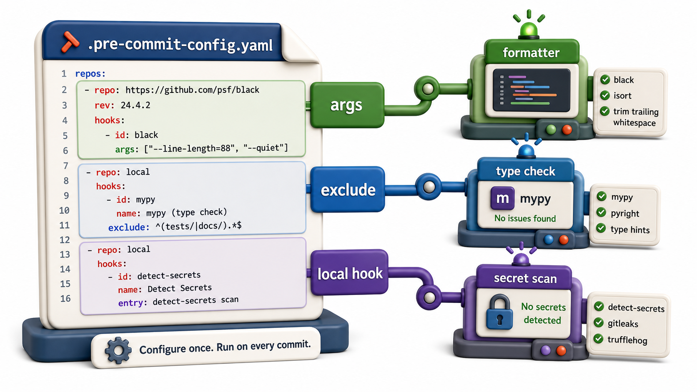

## Introduction

Raj's basic `pre-commit` configuration catches style issues, but his team also needs mypy type-checking and a custom check that prevents anyone from committing a file containing a hardcoded API key. Both of these can be added to the same framework.

This lesson covers configuring existing hooks in detail, adding mypy to the pre-commit pipeline, writing a custom local hook, and tuning the configuration so the pipeline is fast enough that developers do not disable it out of frustration.



## Hook-Level Configuration

Each hook in the config supports additional options:

```yaml
repos:
  - repo: https://github.com/astral-sh/ruff-pre-commit
    rev: v0.4.4
    hooks:
      - id: ruff
        args: [--fix, --exit-non-zero-on-fix]   # pass extra CLI args
        exclude: ^docs/                          # skip the docs/ directory
        types: [python]                          # only run on Python files
        always_run: false                        # only run on staged files

      - id: ruff-format
        exclude: ^tests/fixtures/               # exclude generated fixtures
```

| Option | What it controls |
|---|---|
| `args` | Extra command-line arguments |
| `exclude` | Regex of paths to skip |
| `files` | Regex of paths to include (opposite of exclude) |
| `types` | File types to run on (`python`, `yaml`, `json`) |
| `always_run` | Run even if no matching files are staged |

## Adding mypy as a Local Hook

mypy is not available as a pre-packaged pre-commit hook repository. Run it as a "local" hook that uses the project's installed Python:

```yaml
- repo: local
  hooks:
    - id: mypy
      name: mypy type check
      entry: mypy
      language: system   # use the system/venv Python
      types: [python]
      args: [--strict, --ignore-missing-imports]
      pass_filenames: false   # mypy checks the whole package, not just staged files
```

`language: system` means the hook uses whatever `mypy` is on `PATH`, which should be the project's virtual environment. `pass_filenames: false` tells `pre-commit` not to pass individual filenames as arguments; instead `mypy` is called with no arguments and reads `pyproject.toml` for its configuration.

## Configuring mypy in pyproject.toml

```toml
[tool.mypy]
python_version = "3.11"
strict = true
ignore_missing_imports = true
exclude = ["tests/", "docs/"]
```

When mypy reads `pyproject.toml`, it uses these settings instead of requiring them all on the command line.

## A Custom Secret-Detection Hook

A local hook can run any command:

```yaml
- repo: local
  hooks:
    - id: no-hardcoded-secrets
      name: Detect hardcoded secrets
      entry: python scripts/check_no_secrets.py
      language: system
      types: [python]
```

```python
# scripts/check_no_secrets.py
import sys
import re

PATTERNS = [
    r"(?i)(api_key|secret|password)\s*=\s*['\"][^'\"]{8,}['\"]",
    r"(?i)sk-[a-z0-9]{32,}",   # common API key pattern
]

def check_file(path):
    with open(path) as f:
        content = f.read()
    for pattern in PATTERNS:
        if re.search(pattern, content):
            print(f"Possible secret in {path}")
            return True
    return False

found = any(check_file(p) for p in sys.argv[1:])
sys.exit(1 if found else 0)
```

## Making the Pipeline Fast

A hook pipeline that takes 30 seconds per commit will be skipped with `--no-verify`. Keep it fast:

- `ruff` is very fast (Rust-based, runs in under a second on most projects)
- `black --check` is fast
- `mypy` with caching (`.mypy_cache/`) is acceptably fast after the first run
- Limit slow hooks to `pre-push` instead of `pre-commit`

```yaml
# Move slow hooks to pre-push:
- repo: local
  hooks:
    - id: mypy
      stages: [pre-push]   # only runs on git push, not on every commit
```

## Complete Example Configuration

```yaml
# .pre-commit-config.yaml
repos:
  - repo: https://github.com/astral-sh/ruff-pre-commit
    rev: v0.4.4
    hooks:
      - id: ruff
        args: [--fix]
      - id: ruff-format

  - repo: https://github.com/pre-commit/pre-commit-hooks
    rev: v4.6.0
    hooks:
      - id: trailing-whitespace
      - id: end-of-file-fixer
      - id: check-yaml
      - id: check-merge-conflict
      - id: check-added-large-files
        args: [--maxkb=500]

  - repo: local
    hooks:
      - id: mypy
        name: mypy
        entry: mypy library/
        language: system
        pass_filenames: false
        stages: [pre-push]

      - id: no-hardcoded-secrets
        name: Detect hardcoded secrets
        entry: python scripts/check_no_secrets.py
        language: system
        types: [python]
```

## Configuring Hooks at a Glance

| Config option | Purpose |
|---|---|
| `args` | Extra arguments for the hook command |
| `exclude` | Skip matching paths |
| `types` | Only run on specific file types |
| `language: system` | Use the system/venv Python |
| `pass_filenames: false` | Don't pass staged filenames to the command |
| `stages: [pre-push]` | Run only on push, not on commit |

## Your Turn

Add a `mypy` local hook to your `.pre-commit-config.yaml` and configure mypy in `pyproject.toml`. Then run:

```console
pre-commit run mypy --all-files
```

Fix any type errors found. Then add a simple custom hook that refuses commits containing the string `TODO:` in staged Python files:

```yaml
- id: no-todo-commits
  name: Block TODO commits
  entry: grep -rn "TODO:" --include="*.py"
  language: system
  pass_filenames: false
```

## Conclusion

Hook-level configuration controls which files each hook applies to, which arguments it receives, and which Git stage it runs in. Local hooks run any command on the system. mypy integrates through a local hook with `pass_filenames: false`. Assigning slow hooks to `stages: [pre-push]` keeps commit time fast. The final lesson in this unit covers CI: running all of these checks in a shared pipeline that catches anything that slipped through local hooks.
