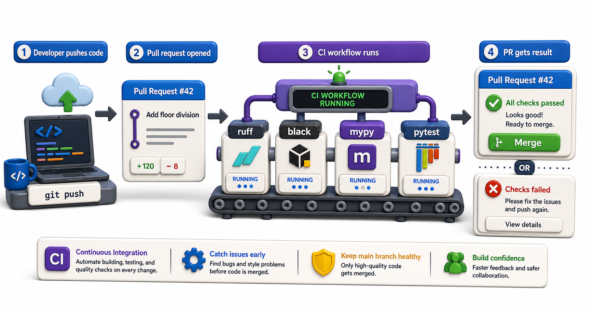

## Introduction

Raj's `pre-commit` hooks catch most issues locally. But two developers worked on separate branches, both passed their hooks, and when their branches were merged, the combined code had a type error that neither developer's local mypy had seen. Local hooks only guard one developer's work at a time. CI (continuous integration) runs the full quality pipeline on every pull request, against the merged code, catching issues that local checks miss.

This lesson introduces the concept of CI and shows how to configure a simple GitHub Actions workflow that runs `ruff`, `black --check`, `mypy`, and `pytest` automatically on every push.



## What CI Is

Continuous integration is the practice of automatically building and testing code whenever it changes. The steps that run automatically are called a "pipeline" or "workflow." On GitHub, these are defined in YAML files inside `.github/workflows/`.

The simplest CI workflow:

1. Trigger: when code is pushed or a pull request is opened
2. Environment: spin up a fresh virtual machine with the specified Python version
3. Steps: install dependencies, run linters, run tests
4. Result: pass (all steps exit 0) or fail (any step exits non-zero)

## A GitHub Actions Workflow

```yaml
# .github/workflows/ci.yml
name: CI

on:
  push:
    branches: [main, develop]
  pull_request:
    branches: [main]

jobs:
  quality:
    runs-on: ubuntu-latest
    strategy:
      matrix:
        python-version: ["3.11", "3.12"]

    steps:
      - uses: actions/checkout@v4

      - name: Set up Python ${{ matrix.python-version }}
        uses: actions/setup-python@v5
        with:
          python-version: ${{ matrix.python-version }}

      - name: Install dependencies
        run: |
          pip install -e ".[dev]"

      - name: Lint with ruff
        run: ruff check .

      - name: Check formatting with black
        run: black --check .

      - name: Type check with mypy
        run: mypy library/

      - name: Run tests with coverage
        run: pytest --cov=library --cov-fail-under=80 tests/
```

## Reading the Workflow

```yaml
on:
  push:
    branches: [main, develop]
  pull_request:
    branches: [main]
```

This triggers the workflow when code is pushed to `main` or `develop`, or when a pull request targets `main`.

```yaml
strategy:
  matrix:
    python-version: ["3.11", "3.12"]
```

The matrix runs the job twice: once with Python 3.11 and once with 3.12. If your code works on 3.11 but breaks on 3.12, the matrix catches it.

```yaml
- name: Install dependencies
  run: |
    pip install -e ".[dev]"
```

`pip install -e ".[dev]"` installs the package in editable mode with the `[dev]` extra, which should include `ruff`, `black`, `mypy`, and `pytest`. These extras are defined in `pyproject.toml`:

```toml
[project.optional-dependencies]
dev = [
    "pytest",
    "pytest-cov",
    "ruff",
    "black",
    "mypy",
]
```

## Blocking Merges on CI Failure

In GitHub's repository settings, branch protection rules can require all CI checks to pass before a pull request can be merged. With this in place:

- `ruff` finding a violation blocks the merge
- `mypy` finding a type error blocks the merge
- A failing test blocks the merge

This is the final safety net. Local hooks catch most issues early; CI catches anything that reached the pull request.

## CI Caching

Installing dependencies on every run is slow. Cache the pip packages between runs:

```yaml
- name: Cache pip
  uses: actions/cache@v4
  with:
    path: ~/.cache/pip
    key: ${{ runner.os }}-pip-${{ hashFiles('pyproject.toml') }}
    restore-keys: |
      ${{ runner.os }}-pip-
```

This caches pip's download cache, keyed by the hash of `pyproject.toml`. If dependencies have not changed, the cache is restored and installation is faster.

## CI at a Glance

| Concept | What it means |
|---|---|
| CI pipeline | Automated quality checks on every push or PR |
| GitHub Actions | GitHub's built-in CI platform (free for public repos) |
| `on: pull_request` | Trigger on PR creation and updates |
| `matrix` | Run the same job with multiple Python versions |
| Branch protection | Block merges if CI fails |
| Cache | Save and restore `~/.cache/pip` between runs |

## Your Turn

Create `.github/workflows/ci.yml` in your library project. Include at least three steps: `ruff check .`, `black --check .`, and `pytest --cov=library tests/`. Push the file to a GitHub repository and open a pull request. Observe the CI checks running. Deliberately introduce a linting error, push again, and confirm the CI step fails.

If you do not have a GitHub repository, read the workflow file carefully and trace through what each step does: which step would catch a style violation? Which would catch a failing test? Which would catch a type error?

## Conclusion

CI runs the full quality pipeline on every pull request against the merged code, catching issues that local hooks miss. GitHub Actions is the most common CI platform for Python projects, configured with YAML files in `.github/workflows/`. Branch protection rules enforce that CI must pass before code can be merged. Together, local `pre-commit` hooks and CI create a two-layer quality gate that enforces consistent, correct code without manual enforcement. Unit 10 moves to asynchronous programming, where Python handles many operations concurrently without creating extra threads or processes.
