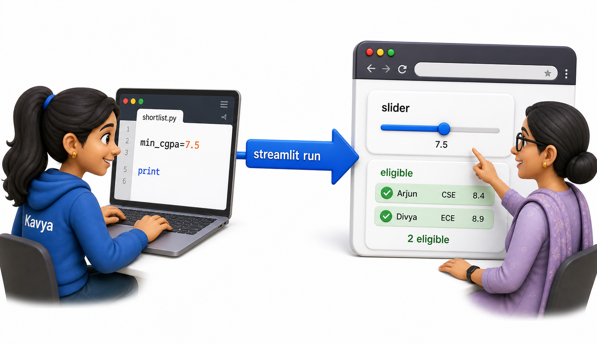
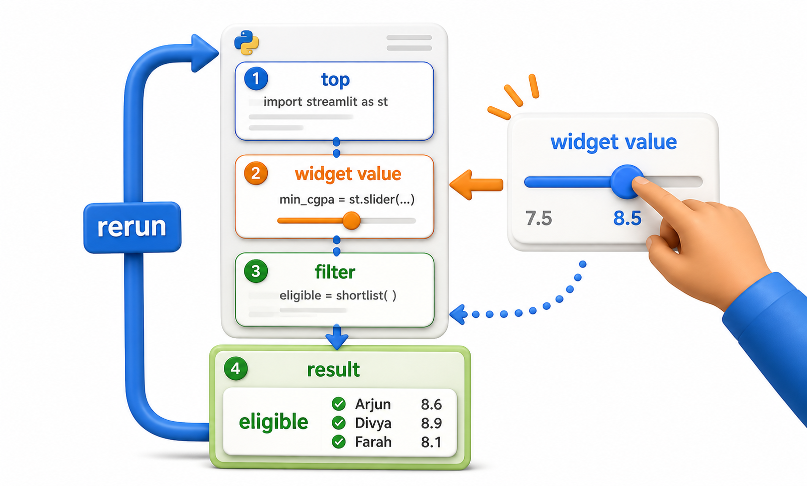
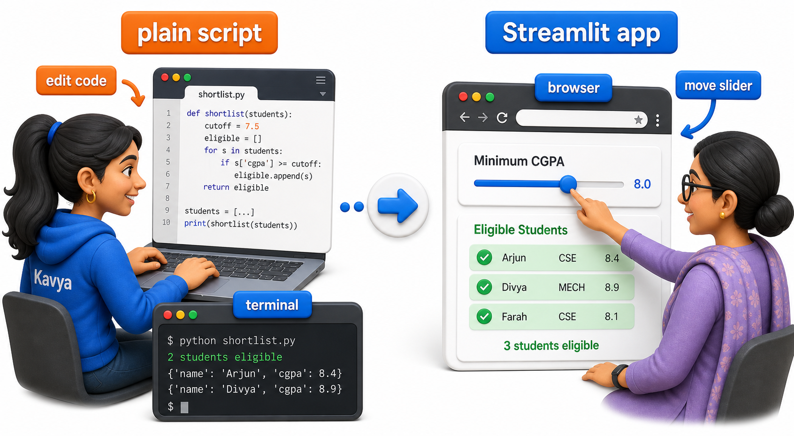

## Introduction

Kavya volunteers with her college's Placement Cell, and every recruitment drive she runs the same little Python script: read the list of registered students, keep only the ones whose CGPA clears the company's cutoff and whose backlog count is within limit, and print the shortlist. It works fine, except for one problem. The placement coordinator does not write Python. Every time she wants to try a different cutoff, "just to see how many students would qualify at 7.5 instead of 8.0," she has to message Kavya, wait for Kavya to edit a number in the script and re-run it, and get a screenshot back.

Streamlit exists to remove exactly that bottleneck. It is a Python library that turns an ordinary script into a page the coordinator can open in a browser, change a number on, and see results update immediately, without either of them touching the terminal again.



## The Script Before Streamlit

Here is roughly what Kavya's shortlist script looks like today. It is plain Python: a list of student records, a filter function, and a `print` loop.

```python
students = [
    {"name": "Arjun", "branch": "CSE", "cgpa": 8.4, "backlogs": 0},
    {"name": "Bhavna", "branch": "ECE", "cgpa": 7.1, "backlogs": 1},
    {"name": "Chetan", "branch": "CSE", "cgpa": 6.8, "backlogs": 2},
    {"name": "Divya", "branch": "MECH", "cgpa": 8.9, "backlogs": 0},
]

def shortlist(students, min_cgpa, max_backlogs):
    return [
        s for s in students
        if s["cgpa"] >= min_cgpa and s["backlogs"] <= max_backlogs
    ]

eligible = shortlist(students, min_cgpa=7.5, max_backlogs=1)

print("Eligible students:")
for s in eligible:
    print(f"- {s['name']} ({s['branch']}, CGPA {s['cgpa']})")
```

Running it prints:

```text
Eligible students:
- Arjun (CSE, CGPA 8.4)
- Divya (MECH, CGPA 8.9)
```

To try `min_cgpa=7.0` instead, Kavya has to open the file, change the number, save, and run it again from her own laptop. The coordinator cannot do any of that herself.

## What Streamlit Adds

Streamlit takes a script exactly like this one and renders its output as a web page instead of terminal text, while adding widgets, sliders, text boxes, buttons, that let the person viewing the page supply values like `min_cgpa` themselves. The Python code barely changes; `print(...)` becomes `st.write(...)`, and a hardcoded number becomes the value returned by a slider. Keeping the existing `students` list and `shortlist()` function from above completely unchanged, Kavya only needs to replace the hardcoded inputs and the terminal output. This version needs the `streamlit run` command and a browser to actually render, so it cannot be run directly the way the plain script above can; it is shown below as a reference snippet rather than something to execute here.

```text
import streamlit as st

st.title("Placement Shortlist Tool")

min_cgpa = st.slider("Minimum CGPA", 0.0, 10.0, 7.5)
max_backlogs = st.number_input("Maximum backlogs allowed", min_value=0, value=1)

eligible = shortlist(students, min_cgpa, max_backlogs)

st.write(f"{len(eligible)} students are eligible:")
for s in eligible:
    st.write(f"{s['name']} ({s['branch']}, CGPA {s['cgpa']})")
```

Saved as `app.py` and started with `streamlit run app.py`, this opens a browser tab showing a title, a slider, a number box, and the live list of eligible students underneath. The coordinator drags the slider to 7.0, and the list on screen updates immediately, no message to Kavya required. The lessons ahead keep using this same pattern: plain, runnable Python to work out the underlying logic, and reference snippets like this one to show how that logic gets wired to Streamlit.

## The Rerun Model: Streamlit's Most Important Habit

There is one mental model worth fixing early, because every later lesson depends on it. By default, every time the coordinator moves the slider, clicks a button, or types into a box, Streamlit reruns the script from the very first line to the last, using each widget's latest value, and redraws the page with the result. Streamlit does have ways to rerun only part of a page or delay a rerun until a form is submitted, but this whole-script default is the one habit every lesson ahead assumes.

Think of it like Kavya re-running her script by hand every single time the coordinator asks for a new cutoff, except automatic and near-instant. Ordinary variables like `eligible` are recreated from scratch on every rerun; they carry no memory of the previous run. What does carry over is the widget's value itself, `min_cgpa` always arrives already set to wherever the slider currently sits, and recomputing `eligible` from that fresh value is what makes the page look like it remembers the coordinator's last few moves, even though nothing is actually being stored on its own.



```python
def one_script_run(min_cgpa, max_backlogs, students):
    eligible = [
        s for s in students
        if s["cgpa"] >= min_cgpa and s["backlogs"] <= max_backlogs
    ]
    print(f"Rerun with min_cgpa={min_cgpa}: {len(eligible)} eligible")
    return eligible

students = [
    {"name": "Arjun", "branch": "CSE", "cgpa": 8.4, "backlogs": 0},
    {"name": "Bhavna", "branch": "ECE", "cgpa": 7.1, "backlogs": 1},
    {"name": "Chetan", "branch": "CSE", "cgpa": 6.8, "backlogs": 2},
    {"name": "Divya", "branch": "MECH", "cgpa": 8.9, "backlogs": 0},
]

# Each call below stands in for one full script rerun,
# triggered by the coordinator moving the slider to a new position.
one_script_run(7.5, 1, students)
one_script_run(7.0, 1, students)
one_script_run(8.5, 0, students)
```

```text
Rerun with min_cgpa=7.5: 2 eligible
Rerun with min_cgpa=7.0: 3 eligible
Rerun with min_cgpa=8.5: 1 eligible
```

Each call above stands in for one rerun, recomputing `eligible` fresh rather than reusing a previous result. That becomes inconvenient the moment Kavya needs something to persist across many reruns, a running list of students the coordinator has manually approved, for instance, which is exactly the problem session state, a few lessons ahead, is built to solve.

## Script vs Streamlit App

| Aspect | Plain script | Streamlit app |
|---|---|---|
| Output | Printed to a terminal | Rendered on a web page |
| Changing an input | Edit the code, re-run manually | Move a slider or type a value, page updates |
| Who can use it | Whoever can run Python locally | Anyone who can reach the deployed app's URL |
| Execution model | Runs once, top to bottom | Reruns entirely on every interaction |

That last row assumes the app has actually been deployed somewhere reachable. A `streamlit run app.py` started on Kavya's own laptop is, by default, only reachable from that laptop, not automatically available to the coordinator over the internet; getting it onto a URL the coordinator can open is a separate, later step.



## Your Turn: Spot What Would Change

Look back at the plain script's filter call, `shortlist(students, min_cgpa=7.5, max_backlogs=1)`, which left Arjun and Divya as the eligible pair. If this were rewired for Streamlit with a slider for `min_cgpa`, and the coordinator dragged that slider up from 7.5 to 8.5 without touching the backlog box, work out by hand which name would drop out of the eligible list.

Arjun's CGPA of 8.4 clears 7.5 comfortably but falls short of an 8.5 cutoff, so tightening the slider that far pushes him out, leaving only Divya, whose 8.9 clears the higher bar. That is the entire rerun in miniature: one changed input, the whole filter recomputed, a new list on screen.

## Conclusion

Streamlit turns a script Kavya already trusts into a page the coordinator can operate herself, by replacing hardcoded values with widgets and `print` with `st.write`, while reusing the filtering logic itself almost unchanged. Carrying that whole-script rerun habit forward, the next lesson stays with this same placement tool and looks at everything Streamlit offers for putting readable text, headings, and instructions on the page, before any widget is added at all.
