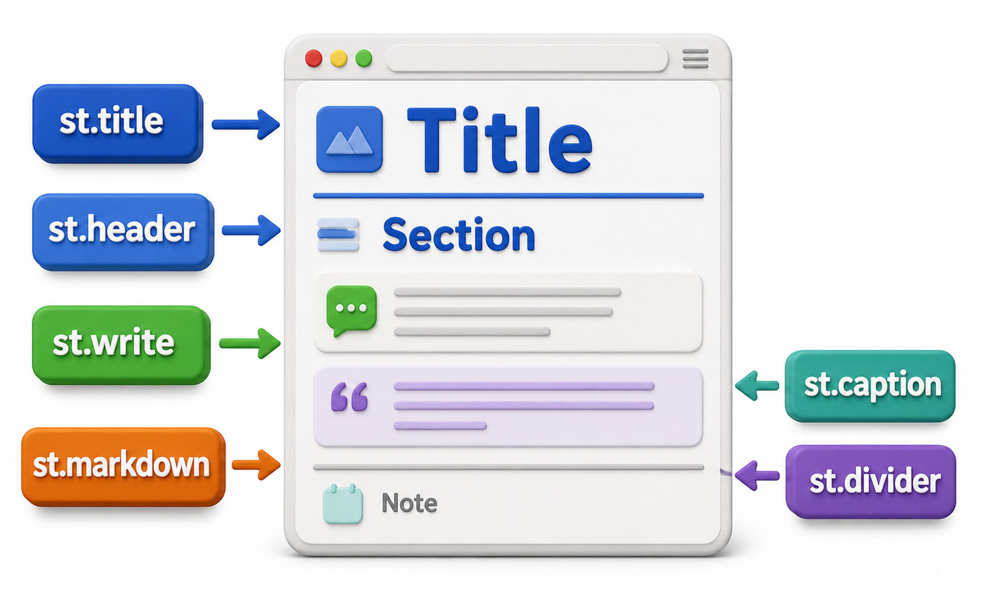
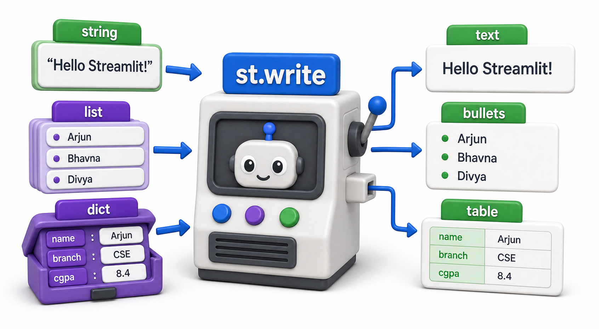
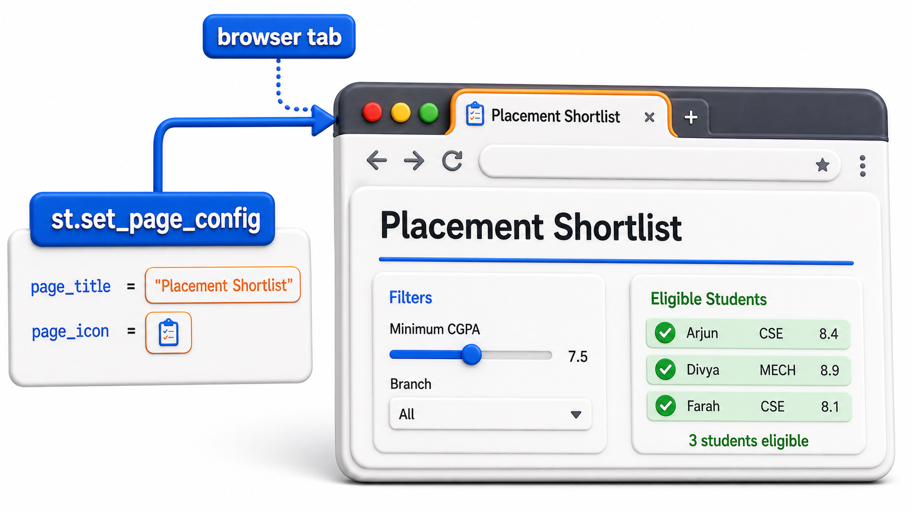

## Introduction

Before Kavya adds a single slider or button to the placement tool, the coordinator needs the page to actually explain itself: a title so she knows what she opened, a short line of instructions, and some visual separation between sections so the page does not read like a wall of text. Streamlit's text functions handle exactly this, and they map closely enough to `print` that the underlying logic can still be worked out in plain Python first.



## Headings: Title, Header, and Subheader

Streamlit gives three sizes of heading, meant to be used in order: `st.title` for the page's one main heading, `st.header` for major sections within the page, and `st.subheader` for smaller sections within those. This is the same hierarchy a printed report would use, just rendered as HTML instead of plain text.

```python
def render_heading(level, text):
    sizes = {"title": "#", "header": "##", "subheader": "###"}
    print(f"{sizes[level]} {text}")

render_heading("title", "Placement Shortlist Tool")
render_heading("header", "Eligible Students")
render_heading("subheader", "Filtered by CGPA and Backlogs")
```

```text
# Placement Shortlist Tool
## Eligible Students
### Filtered by CGPA and Backlogs
```

The Markdown-style hashes above are only there to show the size relationship; on an actual page, Streamlit renders each one as real, differently sized heading text, not literal hash symbols.

```text
st.title("Placement Shortlist Tool")
st.header("Eligible Students")
st.subheader("Filtered by CGPA and Backlogs")
```

## st.write: The Function That Displays Almost Anything

Most of the time, Kavya will not reach for a specific display function at all. `st.write` is Streamlit's general-purpose "just show me this" call: hand it a string, a number, a list, or a dictionary, and it picks a sensible way to render each one.

```python
eligible_count = 3
eligible_names = ["Arjun", "Bhavna", "Divya"]
summary = {"total_registered": 4, "eligible": 3, "cutoff_cgpa": 7.5}

print(f"{eligible_count} students are eligible")
print(eligible_names)
print(summary)
```

```text
3 students are eligible
['Arjun', 'Bhavna', 'Divya']
{'total_registered': 4, 'eligible': 3, 'cutoff_cgpa': 7.5}
```

```text
st.write(f"{eligible_count} students are eligible")
st.write(eligible_names)
st.write(summary)
```

On the page, the string appears as plain text, the list as a bulleted list, and the dictionary as a small expandable key-value table, all from the same `st.write` call, because Streamlit inspects the type of whatever is passed in and renders it accordingly.



## Markdown for Formatted Instructions

When Kavya wants bold text, italics, or a bullet list inside a paragraph rather than a whole heading, `st.markdown` accepts standard Markdown syntax and renders it as formatted text.

```text
st.markdown("""
Use the controls below to adjust the shortlist:
- **CGPA cutoff**: only students at or above this score qualify
- **Backlog limit**: maximum backlogs a student may currently have
*Results update as soon as you change a value.*
""")
```

This would render as a short paragraph with a bulleted list, the words "CGPA cutoff" and "Backlog limit" shown in bold, and the last sentence shown in italics, exactly as Markdown formatting is interpreted anywhere else it is used.

## Captions and Dividers for Polish

Two small additions round out a page's readability. `st.caption` prints a line of small, muted text, useful for a "last updated" note, and `st.divider` draws a thin horizontal line to visually separate sections.

```text
st.title("Placement Shortlist Tool")
st.caption("Data last updated: 10 July 2026")
st.divider()
st.header("Eligible Students")
```

## Setting the Page Title and Icon

One more piece of text lives outside the page body entirely: the browser tab itself. `st.set_page_config`, called once at the very top of the script before anything else, sets the tab's title and icon.

```text
import streamlit as st

st.set_page_config(page_title="Placement Shortlist", page_icon=":clipboard:")

st.title("Placement Shortlist Tool")
```

Without this call, the browser tab would show a generic default title instead of "Placement Shortlist," which matters once the coordinator has several internal tools open in different tabs and needs to tell them apart at a glance.



## Display Functions at a Glance

| Function | Purpose | Typical use here |
|---|---|---|
| `st.title` | One large page heading | "Placement Shortlist Tool" |
| `st.header` / `st.subheader` | Section headings, in decreasing size | "Eligible Students" |
| `st.write` | Display almost any value sensibly | Numbers, lists, dictionaries |
| `st.markdown` | Formatted text with bold, italics, bullets | Instructions paragraph |
| `st.caption` | Small, muted text | "Data last updated" note |
| `st.divider` | Horizontal rule between sections | Separating instructions from results |

## Your Turn: Choose the Right Function

Kavya wants to add a one-line note reading "Only Computer Science and Electronics branches are covered by this drive" underneath the main title, in a font too small to distract from the results below it. Between `st.header`, `st.markdown`, and `st.caption`, decide which is the right fit.

`st.caption` is the right choice: `st.header` would make the note look like a major section rather than a small aside, and plain `st.markdown` would render it at normal paragraph size, both too visually loud for what is meant to be a quiet, secondary note.

## Conclusion

`st.title`, `st.header`, and `st.subheader` give a page its structure, `st.write` handles most display needs without any special formatting, and `st.markdown`, `st.caption`, and `st.divider` add the finishing touches that make a page readable rather than cluttered. None of this lets the coordinator change anything yet; the page still only displays whatever Kavya hardcoded. The next lesson introduces the widgets that turn those hardcoded numbers into values she can adjust herself.
