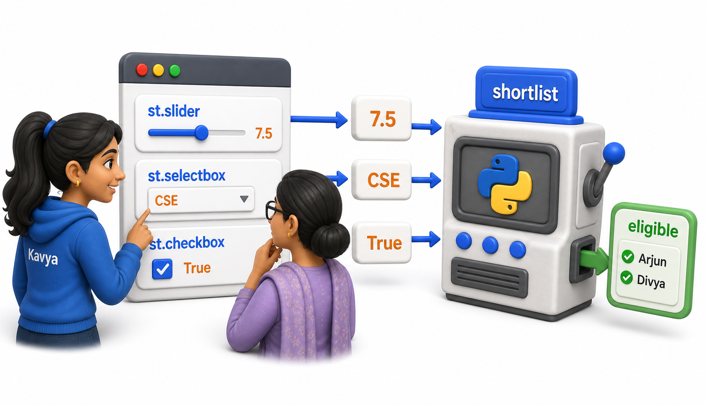
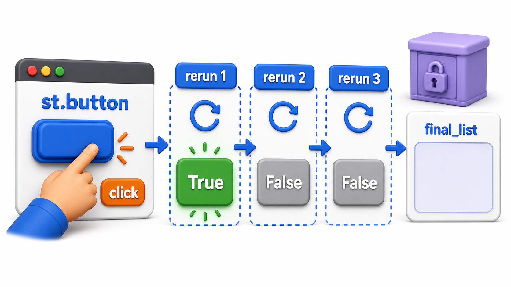
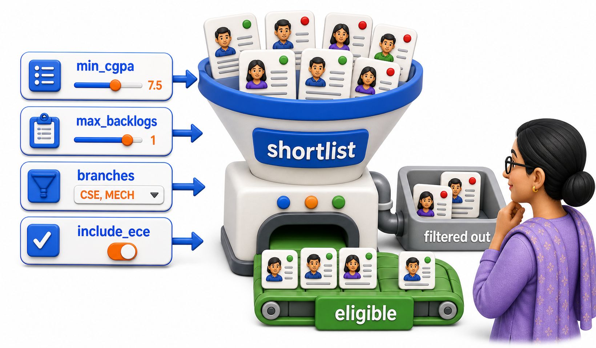

## Introduction

The placement tool can now display a title, instructions, and a hardcoded list of eligible students, but the coordinator still cannot change the cutoff herself. That is the entire point of Streamlit's input widgets: each one draws a control on the page, a slider, a text box, a dropdown, and simply returns whatever the person viewing the page currently has it set to. There is no separate "read the form" step; the widget call itself is the value.



## The Core Idea: A Widget Call Returns Its Current Value

Every Streamlit input widget follows the same shape: call it, give it a label and some options, and it hands back a plain Python value, exactly as if `input()` had returned it, except it also draws the control on the page.

```python
def slider_value_right_now():
    # Stands in for whatever position the coordinator has
    # dragged the CGPA slider to on the page.
    return 7.5

min_cgpa = slider_value_right_now()
print(f"min_cgpa is currently: {min_cgpa}")
```

```text
min_cgpa is currently: 7.5
```

```text
min_cgpa = st.slider("Minimum CGPA", min_value=0.0, max_value=10.0, value=7.5)
```

The moment the coordinator drags the slider, Streamlit reruns the whole script, as covered in the first lesson, and this line returns the new position instead. `min_cgpa` is never stale; it always reflects the slider's current position on that particular rerun.

## Numbers, Text, and Choices

Kavya's tool needs several different kinds of input, and Streamlit has a matching widget for each.

```python
def current_filter_inputs():
    min_cgpa = 7.5                 # st.slider
    max_backlogs = 1               # st.number_input
    branch = "CSE"                 # st.selectbox
    only_zero_backlog = False      # st.checkbox
    return min_cgpa, max_backlogs, branch, only_zero_backlog

min_cgpa, max_backlogs, branch, only_zero_backlog = current_filter_inputs()
print(f"Filtering: CGPA >= {min_cgpa}, backlogs <= {max_backlogs}, "
      f"branch = {branch}, zero-backlog only = {only_zero_backlog}")
```

```text
Filtering: CGPA >= 7.5, backlogs <= 1, branch = CSE, zero-backlog only = False
```

```text
min_cgpa = st.slider("Minimum CGPA", 0.0, 10.0, 7.5)
max_backlogs = st.number_input("Maximum backlogs allowed", min_value=0, value=1)
branch = st.selectbox("Branch", ["CSE", "ECE", "MECH", "All"])
only_zero_backlog = st.checkbox("Show only students with zero backlogs")
```

`st.number_input` behaves like `st.slider` but as a typed box instead of a drag handle, useful when exact values matter more than quick adjustment. `st.selectbox` draws a dropdown and returns whichever option is currently chosen. `st.checkbox` returns `True` or `False` depending on whether it is ticked.

## Choosing Several Values at Once

Some choices are not one-of-many but several-of-many. If the coordinator wants to run the drive for more than one branch simultaneously, `st.multiselect` returns a list of every option currently selected, rather than a single value.

```python
def current_branch_selection():
    return ["CSE", "ECE"]  # both ticked in the multiselect

selected_branches = current_branch_selection()
print(f"Branches included: {selected_branches}")
```

```text
Branches included: ['CSE', 'ECE']
```

```text
selected_branches = st.multiselect(
    "Branches to include", ["CSE", "ECE", "MECH"], default=["CSE", "ECE"]
)
```

## Buttons: Input That Fires Once Per Click

Sliders and checkboxes hold a persistent value, but sometimes Kavya needs a one-off action, "run the filter now," rather than a value that sits there. `st.button` returns `True` only on the exact rerun triggered by that click, and `False` on every other rerun, including the very next one.



```python
def button_was_clicked_this_rerun(clicked_this_time):
    if clicked_this_time:
        print("Button was clicked: running the filter now.")
    else:
        print("Button not clicked on this rerun: nothing to do.")

button_was_clicked_this_rerun(True)
button_was_clicked_this_rerun(False)
```

```text
Button was clicked: running the filter now.
Button not clicked on this rerun: nothing to do.
```

```text
if st.button("Run Filter"):
    eligible = shortlist(students, min_cgpa, max_backlogs, branches)
    st.write(eligible)
```

(`shortlist` here is the same four-argument filter function the next section defines in full, students, cutoff, backlog limit, and branches.) This is a common source of confusion for anyone new to Streamlit: the button's `True` is not remembered after that one rerun. Building anything that needs to persist past a single click, a running shortlist the coordinator adds to one student at a time, for instance, needs the session state tool covered in the next lesson.

## Putting Several Widgets to Work Together

None of this is useful until the widget values actually feed into the filtering logic from the first lesson.

```python
students = [
    {"name": "Arjun", "branch": "CSE", "cgpa": 8.4, "backlogs": 0},
    {"name": "Bhavna", "branch": "ECE", "cgpa": 7.1, "backlogs": 1},
    {"name": "Chetan", "branch": "CSE", "cgpa": 6.8, "backlogs": 2},
    {"name": "Divya", "branch": "MECH", "cgpa": 8.9, "backlogs": 0},
]

def shortlist(students, min_cgpa, max_backlogs, branches):
    return [
        s for s in students
        if s["cgpa"] >= min_cgpa
        and s["backlogs"] <= max_backlogs
        and s["branch"] in branches
    ]

# Values a coordinator has currently set on the widgets:
min_cgpa = 7.0
max_backlogs = 1
branches = ["CSE", "ECE"]

eligible = shortlist(students, min_cgpa, max_backlogs, branches)
for s in eligible:
    print(f"{s['name']} ({s['branch']}, CGPA {s['cgpa']})")
```

```text
Arjun (CSE, CGPA 8.4)
Bhavna (ECE, CGPA 7.1)
```

```text
min_cgpa = st.slider("Minimum CGPA", 0.0, 10.0, 7.0)
max_backlogs = st.number_input("Maximum backlogs allowed", min_value=0, value=1)
branches = st.multiselect("Branches to include", ["CSE", "ECE", "MECH"], default=["CSE", "ECE"])

eligible = shortlist(students, min_cgpa, max_backlogs, branches)
st.write(f"{len(eligible)} students eligible")
for s in eligible:
    st.write(f"{s['name']} ({s['branch']}, CGPA {s['cgpa']})")
```

Chetan is excluded on CGPA, and Divya is excluded because MECH is not in the selected branches, exactly as the plain function above computed.



## Input Widgets at a Glance

| Widget | Returns | Kavya's use |
|---|---|---|
| `st.slider` | A number within a range | Minimum CGPA |
| `st.number_input` | A typed number | Maximum backlogs |
| `st.selectbox` | One chosen option | Single branch |
| `st.multiselect` | A list of chosen options | Several branches |
| `st.checkbox` | `True` or `False` | Zero-backlog-only toggle |
| `st.button` | `True` only on the click's own rerun | "Run Filter" action |

## Your Turn: Predict the Filter

Using the `shortlist` function above, work out by hand what would be printed if the coordinator set `min_cgpa = 8.0`, `max_backlogs = 0`, and `branches = ["CSE", "ECE", "MECH"]`.

Only Arjun and Divya clear an 8.0 CGPA cutoff, and both already have zero backlogs, so both remain; Bhavna is excluded on CGPA despite having no branch restriction working against her, and Chetan fails on both counts.

## Conclusion

Every Streamlit input widget, whether a slider, a dropdown, or a checkbox, works the same way: call it once per rerun, and it returns whatever value is currently set on the page, ready to be used exactly like any other Python variable. Buttons are the one exception worth remembering, returning `True` only for the single rerun triggered by that click. That exception is precisely why the next lesson exists: to keep something, a running list, a counter, a chosen state, alive across many reruns instead of losing it the instant the next interaction happens.
