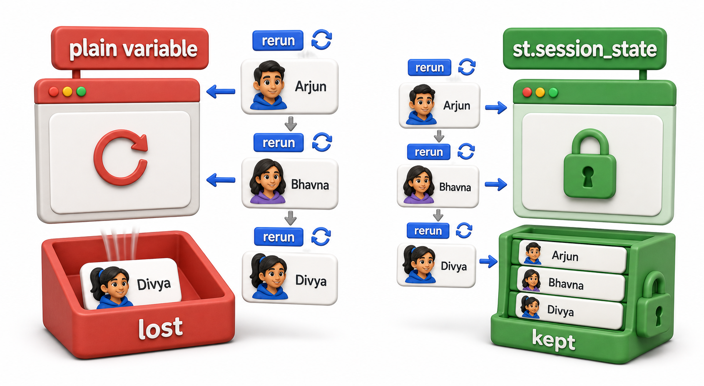
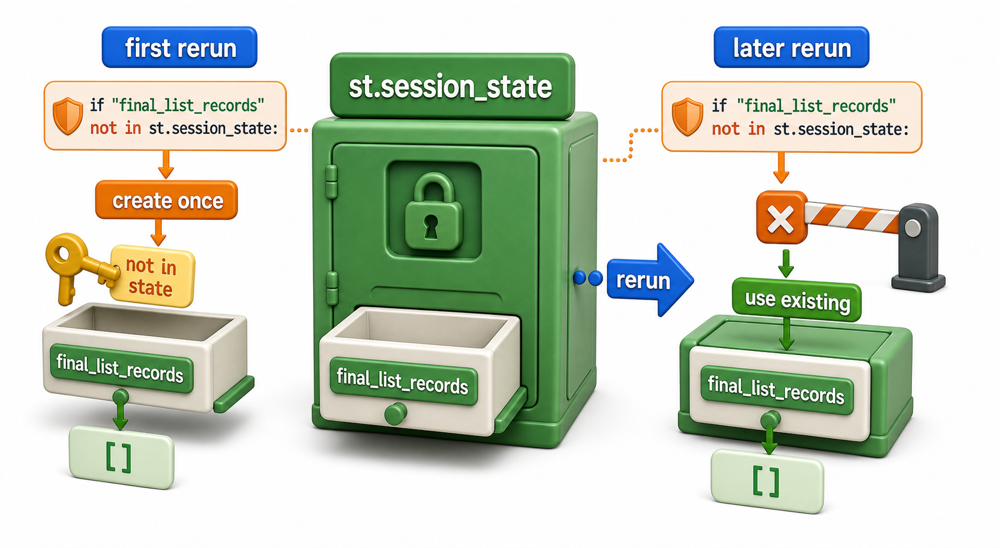
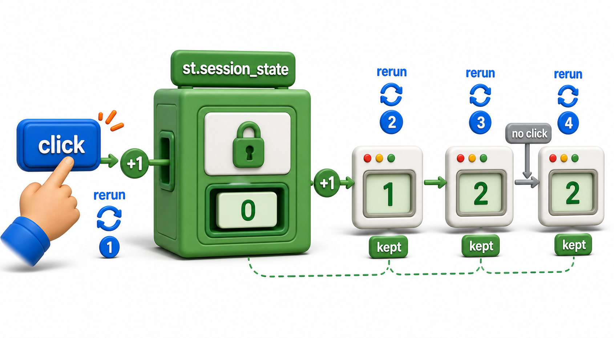

## Introduction

The coordinator has started using the filter from the last lesson, but she has asked for one more thing: a way to go through the eligible students one at a time and click "Add to Final List" for the ones she personally approves, building up a shortlist as she goes. Kavya wires up a button and a list, tests it, and finds a bug: every click seems to wipe out everything added before it, leaving only the single most recent name. This lesson is about why that happens and how `st.session_state` fixes it.



## Why a Plain Variable Cannot Remember Anything

The first lesson established that, by default, Streamlit reruns the entire script, top to bottom, on every interaction. That means any ordinary variable defined in the script is recreated fresh on every single rerun, with whatever value its line of code gives it, and nothing from the previous rerun survives.

```python
def one_rerun(clicked_name, previous_final_list_from_last_rerun):
    # A plain variable, redefined fresh on every rerun, exactly
    # like final_list = [] would be if it sat directly in the script.
    final_list = []
    if clicked_name:
        final_list.append(clicked_name)
    print(f"final_list after this rerun: {final_list}")

# Three separate reruns, one per button click, each starting over.
one_rerun("Arjun", [])
one_rerun("Bhavna", [])
one_rerun("Divya", [])
```

```text
final_list after this rerun: ['Arjun']
final_list after this rerun: ['Bhavna']
final_list after this rerun: ['Divya']
```

This is exactly Kavya's bug. `final_list = []` runs again on every rerun, so each click starts from empty and adds exactly one name, and the two names added on earlier clicks are simply gone, because the variable holding them no longer exists once that rerun finished.

## st.session_state: A Dictionary That Survives Reruns

`st.session_state` is a dictionary-like object Streamlit keeps alive for as long as one person's browser session stays open, across every rerun that person triggers. Anything stored in it is still there on the next rerun, unlike a plain variable.

```python
def one_rerun_with_persistent_state(clicked_name, session_state):
    # session_state is passed in here to represent the SAME
    # dictionary carrying over from the previous rerun, unlike
    # final_list above, which was recreated empty each time.
    if "final_list" not in session_state:
        session_state["final_list"] = []
    if clicked_name:
        session_state["final_list"].append(clicked_name)
    print(f"final_list after this rerun: {session_state['final_list']}")

session_state = {}  # the one persistent store, created only once
one_rerun_with_persistent_state("Arjun", session_state)
one_rerun_with_persistent_state("Bhavna", session_state)
one_rerun_with_persistent_state("Divya", session_state)
```

```text
final_list after this rerun: ['Arjun']
final_list after this rerun: ['Arjun', 'Bhavna']
final_list after this rerun: ['Arjun', 'Bhavna', 'Divya']
```

The difference is entirely in that `if "final_list" not in session_state` check: it only creates an empty list the very first time, and every later rerun finds it already there and appends to it instead of replacing it. That single guard is the whole trick behind making Streamlit remember anything.



## Wiring This Into the Actual App

The coordinator needs the full record for each approved student, not just a name, since later lessons hand this same list to a table and a CSV download. So the app stores whole student dictionaries under `st.session_state.final_list_records`, using exactly the initialization guard just demonstrated in plain Python.

```text
if "final_list_records" not in st.session_state:
    st.session_state.final_list_records = []

for s in eligible:
    if st.button(f"Add {s['name']}"):
        st.session_state.final_list_records.append(s)

st.write("Approved so far:", [r["name"] for r in st.session_state.final_list_records])
```

`st.session_state` supports attribute-style access, `st.session_state.final_list_records`, as well as dictionary-style access, `st.session_state["final_list_records"]`; both refer to the same underlying store. The initialization check runs on every single rerun, but after the first one it always finds `final_list_records` already present and skips straight past it, leaving the accumulated list untouched.

## A Counter, the Simplest Possible Example

Session state is not only for lists. A running count works the same way, and makes the pattern even easier to see.

```python
def one_rerun_counter(button_clicked, session_state):
    if "clicks" not in session_state:
        session_state["clicks"] = 0
    if button_clicked:
        session_state["clicks"] += 1
    print(f"Total clicks so far: {session_state['clicks']}")

session_state = {}
one_rerun_counter(True, session_state)
one_rerun_counter(True, session_state)
one_rerun_counter(False, session_state)
one_rerun_counter(True, session_state)
```

```text
Total clicks so far: 1
Total clicks so far: 2
Total clicks so far: 2
Total clicks so far: 3
```

Notice the third rerun, where the button was not clicked: the count stays at 2 rather than resetting to 0, because `session_state["clicks"]` was already sitting at 2 from before, and only the `if button_clicked` branch, which did not run, would have changed it.



```text
if "clicks" not in st.session_state:
    st.session_state.clicks = 0

if st.button("Add to Final List"):
    st.session_state.clicks += 1

st.write(f"Total approved so far: {st.session_state.clicks}")
```

## Session State vs a Plain Variable

| Aspect | Plain variable | `st.session_state` entry |
|---|---|---|
| Survives a rerun? | No, recreated fresh each time | Yes, persists across reruns |
| Needs initialization guard? | No | Yes, `if "key" not in st.session_state` |
| Good for | Values recomputed from current widget inputs | Running totals, accumulated lists, anything a button should build up over time |

## Your Turn: Trace the State

Using the `one_rerun_with_persistent_state` function above, work out what `final_list` would hold after four reruns with `clicked_name` values, in order, of `"Chetan"`, `None`, `"Arjun"`, `None`.

`None` is falsy, so the `if clicked_name` branch is skipped on the second and fourth reruns, leaving the list unchanged on those. The final result is `['Chetan', 'Arjun']`, one name added on each of the two reruns where a real name was passed in, exactly as the earlier three-click trace behaved.

## Conclusion

A plain variable in a Streamlit script is rebuilt from scratch on every rerun and remembers nothing; `st.session_state` is the one dictionary-like store Streamlit keeps alive across all of a person's reruns, and the `if "key" not in st.session_state` guard is what makes initializing it safe to run every single time without wiping out what is already there. With that in place, Kavya's "Add to Final List" buttons can build up a real, persistent shortlist one click at a time. The next lesson turns to arranging all of this, filters, buttons, and results, into a page that does not feel like everything is stacked in one long column.
