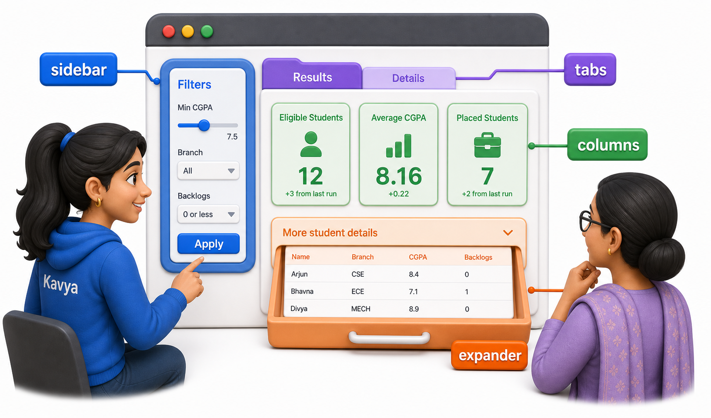
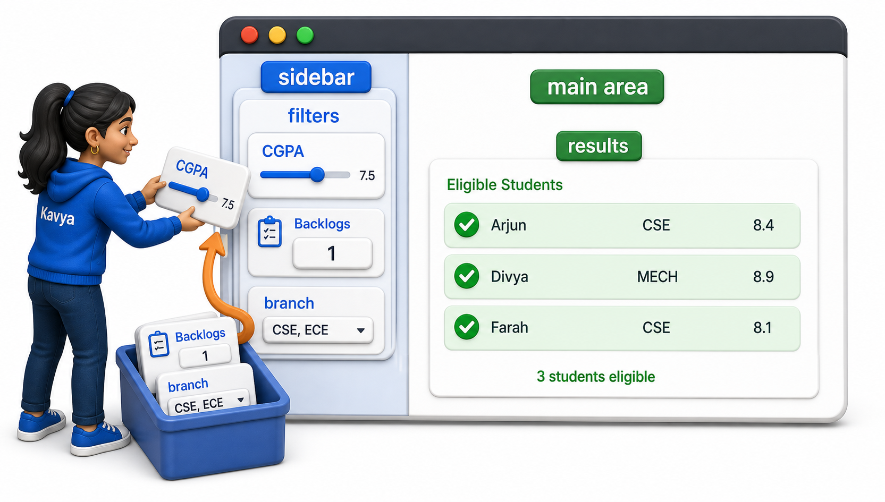
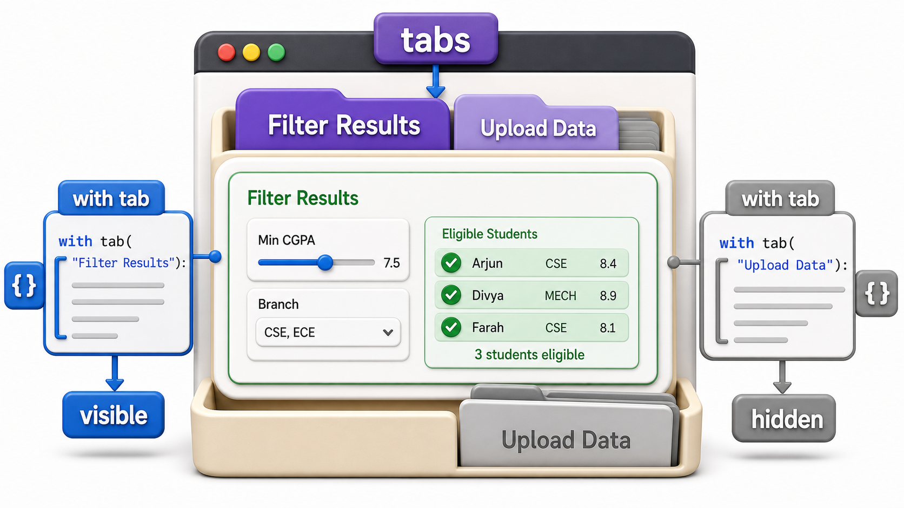

## Introduction

The placement tool now has a title, instructions, four filter widgets, a results list, and a running "Final List" the coordinator builds by clicking. Stacked one after another, that is a long page to scroll through before reaching the results at all. Streamlit's layout tools, the sidebar, columns, tabs, and expanders, do not change any of the logic from the last four lessons; they only change where each piece sits on the page.



## The Sidebar: Filters Out of the Main Flow

The most common fix for a page cluttered with input widgets is to move them into a collapsible sidebar, leaving the main area free for results. Anything called on `st.sidebar` instead of directly on `st` renders there instead of in the main column.

```text
min_cgpa = st.sidebar.slider("Minimum CGPA", 0.0, 10.0, 7.5)
max_backlogs = st.sidebar.number_input("Maximum backlogs allowed", min_value=0, value=1)
branches = st.sidebar.multiselect("Branches to include", ["CSE", "ECE", "MECH"], default=["CSE", "ECE"])

st.title("Placement Shortlist Tool")
eligible = shortlist(students, min_cgpa, max_backlogs, branches)
st.write(f"{len(eligible)} students eligible")
```

The filtering logic itself, `shortlist(students, min_cgpa, max_backlogs, branches)`, is identical to the version from the input widgets lesson; only the three lines calling `st.sidebar.slider` and its neighbors instead of `st.slider` changed. On the page, the coordinator now sees a narrow panel on the left holding every filter, and the main area holds nothing but the title and results.



## Columns: Placing Things Side by Side

Inside the main area, `st.columns(n)` splits the width into `n` equal side-by-side sections, useful for showing several short summary numbers, total registered, eligible count, final list count, without stacking them vertically.

```python
def summary_counts(students, eligible, final_list):
    total = len(students)
    eligible_count = len(eligible)
    approved_count = len(final_list)
    print(f"Total registered: {total}")
    print(f"Eligible after filter: {eligible_count}")
    print(f"Approved to final list: {approved_count}")

students = [
    {"name": "Arjun", "branch": "CSE", "cgpa": 8.4, "backlogs": 0},
    {"name": "Bhavna", "branch": "ECE", "cgpa": 7.1, "backlogs": 1},
    {"name": "Chetan", "branch": "CSE", "cgpa": 6.8, "backlogs": 2},
    {"name": "Divya", "branch": "MECH", "cgpa": 8.9, "backlogs": 0},
]
eligible = [students[0], students[1]]
final_list = ["Arjun"]

summary_counts(students, eligible, final_list)
```

```text
Total registered: 4
Eligible after filter: 2
Approved to final list: 1
```

```text
col1, col2, col3 = st.columns(3)
col1.metric("Total Registered", total)
col2.metric("Eligible", eligible_count)
col3.metric("Approved", approved_count)
```

`st.columns(3)` returns three column objects, and calling `.metric(...)`, or `.write(...)`, or almost any display function, on one of them places that content inside that specific column instead of the full page width. The result on screen is three boxes sitting in a row rather than three lines stacked one above the other.

## Tabs: Separating Distinct Views

Kavya's tool is starting to do two fairly different things: filtering and reviewing students, and, as a later lesson adds, uploading a fresh CSV of registrations. `st.tabs` groups content that belongs to distinct views under clickable tab headers, so only one view's content shows at a time. `eligible` below is the same list the filtering step from earlier lessons already produces.

```text
tab_filter, tab_upload = st.tabs(["Filter Results", "Upload Data"])

with tab_filter:
    st.write(f"{len(eligible)} students eligible")
    for s in eligible:
        st.write(s["name"])

with tab_upload:
    st.write("Upload a CSV of registered students below.")
```

Everything indented under `with tab_filter:` only appears when the "Filter Results" tab is the active one, and everything under `with tab_upload:` only appears when "Upload Data" is active. The `with` block is what scopes content to a particular tab, not the order in which the code runs.



## Expanders: Hiding Detail Until Asked For

Not everything needs to be visible immediately. `st.expander` draws a collapsible section, closed by default, that only reveals its content when clicked, useful for something like the full list of students who did not clear the filter, information the coordinator rarely needs but should be able to check.

```python
students = [
    {"name": "Arjun", "branch": "CSE", "cgpa": 8.4, "backlogs": 0},
    {"name": "Bhavna", "branch": "ECE", "cgpa": 7.1, "backlogs": 1},
    {"name": "Chetan", "branch": "CSE", "cgpa": 6.8, "backlogs": 2},
    {"name": "Divya", "branch": "MECH", "cgpa": 8.9, "backlogs": 0},
]
eligible = [students[0], students[1]]

def rejected_students(students, eligible):
    eligible_names = {s["name"] for s in eligible}
    return [s for s in students if s["name"] not in eligible_names]

rejected = rejected_students(students, eligible)
print("Rejected:", [s["name"] for s in rejected])
```

```text
Rejected: ['Chetan', 'Divya']
```

```text
with st.expander("Show students who did not qualify"):
    for s in rejected:
        st.write(f"{s['name']} (CGPA {s['cgpa']}, backlogs {s['backlogs']})")
```

Until the coordinator clicks "Show students who did not qualify," that section stays collapsed to a single line, keeping the default view focused on who qualified rather than who did not.

## Layout Tools at a Glance

| Tool | Effect | Kavya's use |
|---|---|---|
| `st.sidebar` | Moves widgets to a side panel | All filter controls |
| `st.columns(n)` | Places content side by side in `n` sections | Total, eligible, and approved counts |
| `st.tabs([...])` | Groups content under clickable tab headers | Filter results vs upload |
| `st.expander` | Hides content behind a collapsible toggle | Rejected students list |

## Your Turn: Pick the Right Layout

Kavya wants to add one more piece: a short paragraph explaining exactly how the CGPA and backlog filters interact, meant only for a coordinator who is new to the tool and clicks to read it, not something every visitor should see immediately. Between `st.columns`, `st.tabs`, and `st.expander`, which fits?

`st.expander` is the fit: `st.columns` is for placing several short things side by side rather than hiding one longer explanation, and `st.tabs` is for switching between views the coordinator uses regularly, not an optional aside most visitors can skip entirely.

## Conclusion

Sidebar, columns, tabs, and expanders all do one job: change where content sits and how much of it is visible by default, without touching the filtering logic, the widgets, or the session state built up in earlier lessons. A well-organized page keeps controls in the sidebar, key numbers in columns, distinct workflows in separate tabs, and optional detail behind expanders. The next lesson turns to the results themselves, showing the eligible students as a proper table and the branch-wise breakdown as a chart, instead of one name per line.
