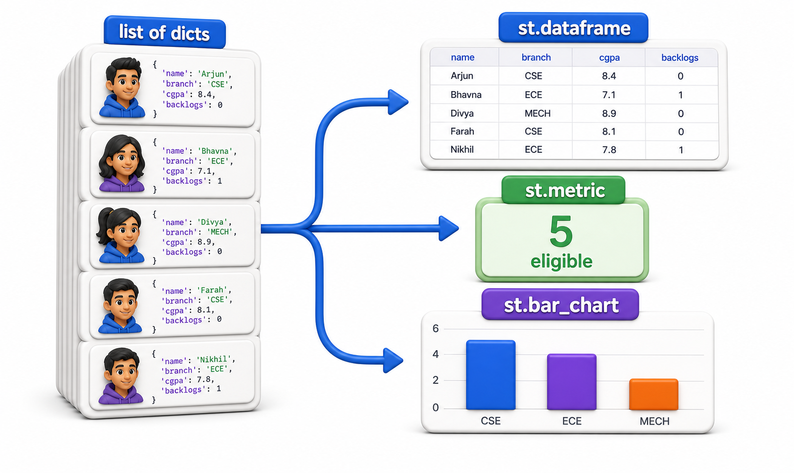
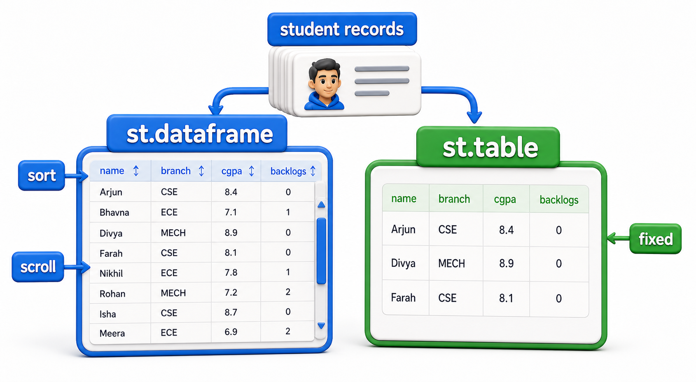
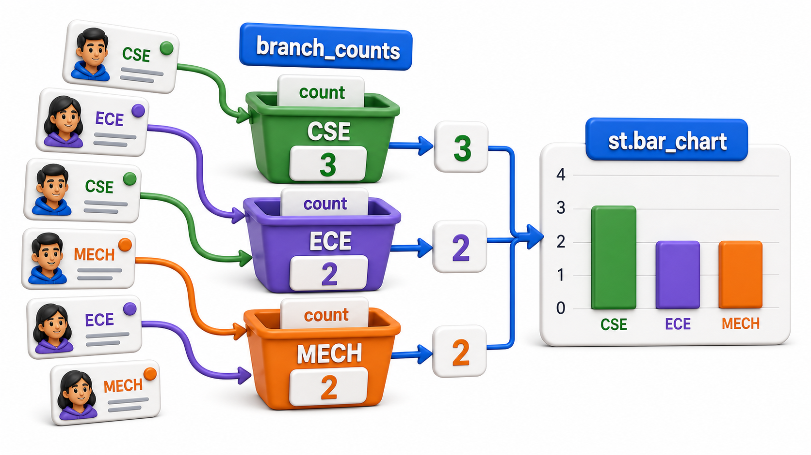

## Introduction

Printing one student per line, `st.write(f"{s['name']} ({s['branch']}, CGPA {s['cgpa']})")`, has worked well enough through the earlier lessons, but the coordinator has started asking for something closer to a spreadsheet: a proper table she can scan column by column, plus a quick visual sense of which branches are producing the most eligible students. Streamlit has dedicated functions for exactly this, built to take the same list-of-dictionaries structure Kavya has been using all along.



## st.dataframe: An Interactive Table

`st.dataframe` takes tabular data, a list of dictionaries works directly, and renders it as a scrollable, sortable table, closer to a spreadsheet than a bulleted list.

```python
eligible = [
    {"name": "Arjun", "branch": "CSE", "cgpa": 8.4, "backlogs": 0},
    {"name": "Bhavna", "branch": "ECE", "cgpa": 7.1, "backlogs": 1},
    {"name": "Divya", "branch": "MECH", "cgpa": 8.9, "backlogs": 0},
]

# A plain-text stand-in for what a table renders as rows and columns.
headers = list(eligible[0].keys())
print(" | ".join(headers))
for s in eligible:
    print(" | ".join(str(s[h]) for h in headers))
```

```text
name | branch | cgpa | backlogs
Arjun | CSE | 8.4 | 0
Bhavna | ECE | 7.1 | 1
Divya | MECH | 8.9 | 0
```

```text
st.dataframe(eligible)
```

On the page, this becomes a real table with clickable column headers the coordinator can use to sort by CGPA or backlogs herself, something a plain loop of `st.write` calls has no way of offering.

## st.table: A Simpler, Static Table

When sorting and scrolling are not needed, and the table is short enough to show in full, `st.table` renders a plain, static table instead, with no interactivity but a slightly cleaner look for something like a short "Final List" of approved students.

```text
st.table(st.session_state.final_list_records)
```

(`final_list_records` is the running list of approved student dictionaries built up in `st.session_state` across button clicks, as covered in the session state lesson.)

The choice between the two is mostly about size and interactivity: `st.dataframe` for anything the coordinator might want to sort or scroll through, `st.table` for a short, fixed list meant to be read top to bottom, like the final approved names.



## st.metric: A Single Number With Context

For a headline number, `st.metric` shows a label, a value, and an optional delta, useful for something like "how many more students qualified after loosening the cutoff."

```python
def eligible_before_and_after(before_count, after_count):
    delta = after_count - before_count
    print(f"Eligible: {after_count} (change: {delta:+d})")

eligible_before_and_after(before_count=2, after_count=3)
```

```text
Eligible: 3 (change: +1)
```

```text
st.metric("Eligible Students", value=3, delta=1)
```

The delta on the page is shown with a small green up-arrow for a positive change or a red down-arrow for a negative one, giving the coordinator an at-a-glance read on whether her latest adjustment widened or narrowed the shortlist.

## Charts: Seeing the Branch-Wise Breakdown

Streamlit's simplest charting functions, `st.bar_chart` and `st.line_chart`, take data shaped as counts or series and draw a chart directly, no separate charting library needed for something this straightforward. Before drawing anything, the counting itself is plain Python.



```python
eligible = [
    {"name": "Arjun", "branch": "CSE", "cgpa": 8.4, "backlogs": 0},
    {"name": "Bhavna", "branch": "ECE", "cgpa": 7.1, "backlogs": 1},
    {"name": "Divya", "branch": "MECH", "cgpa": 8.9, "backlogs": 0},
    {"name": "Farhan", "branch": "CSE", "cgpa": 7.9, "backlogs": 0},
]

def branch_counts(eligible):
    counts = {}
    for s in eligible:
        counts[s["branch"]] = counts.get(s["branch"], 0) + 1
    return counts

counts = branch_counts(eligible)
for branch, count in counts.items():
    bar = "#" * count
    print(f"{branch:5}: {bar} ({count})")
```

```text
CSE  : ## (2)
ECE  : # (1)
MECH : # (1)
```

```text
counts = branch_counts(eligible)
st.bar_chart(counts)
```

The `#` characters above stand in for the actual bars Streamlit draws; on the page, `st.bar_chart(counts)` renders CSE's bar visibly taller than ECE's and MECH's, using the same `counts` dictionary computed in plain Python. The counting logic, `branch_counts`, never needs to know it will eventually feed a chart instead of a printed line.

## Data Display Functions at a Glance

| Function | Best for | Interactive? |
|---|---|---|
| `st.dataframe` | Larger or sortable tables | Yes, sortable and scrollable |
| `st.table` | Short, fixed tables | No |
| `st.metric` | One headline number, with optional change | No, but visually emphasized |
| `st.bar_chart` / `st.line_chart` | Counts or series over categories or time | Basic hover tooltips |

## Your Turn: Choose the Display

The coordinator asks for three things on one page: the full list of all thirty registered students with the ability to sort by CGPA, a single number showing how many are currently eligible, and a visual sense of eligible students per branch. Match each to `st.dataframe`, `st.metric`, or `st.bar_chart`.

The sortable list of thirty students is `st.dataframe`, since sorting and scrolling matter at that size; the single eligible count is `st.metric`, a headline number rather than a table; and the per-branch breakdown is `st.bar_chart`, built from the same `branch_counts`-style aggregation shown above.

## Conclusion

`st.dataframe` and `st.table` turn a list of dictionaries into a real table instead of a manually printed line per row, `st.metric` gives a single number visual weight, and `st.bar_chart` draws directly from a plain Python dictionary of counts, no extra library required for something this simple. In every case, the aggregation itself, filtering, counting by branch, comparing before and after, stays ordinary Python; only the last step, handing the result to a display function, changes. The next lesson lets the coordinator bring her own data in, and take the final shortlist back out, instead of relying on Kavya to hardcode the student list.
