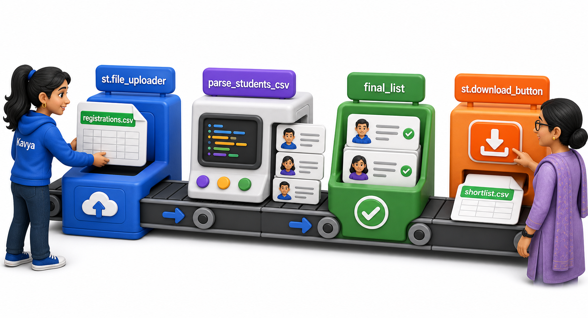
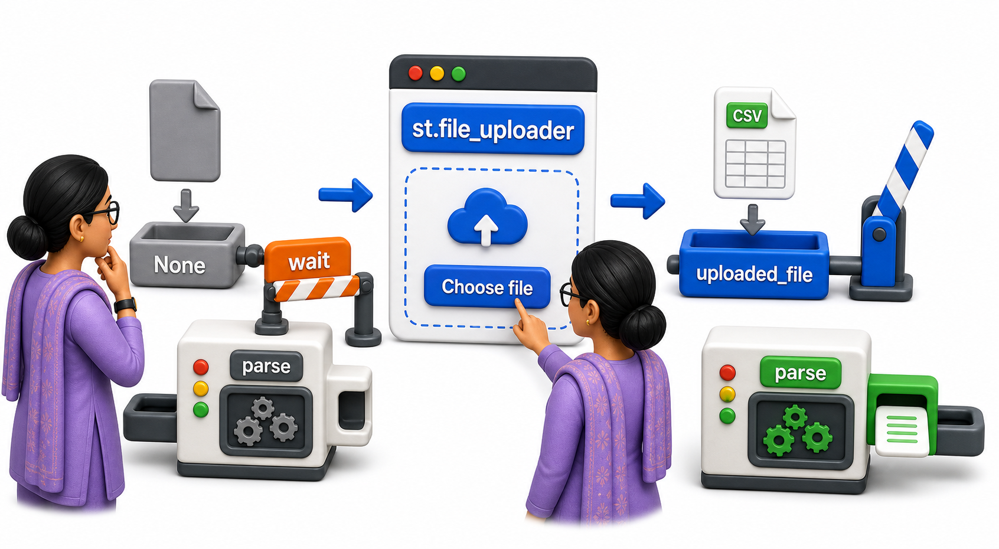
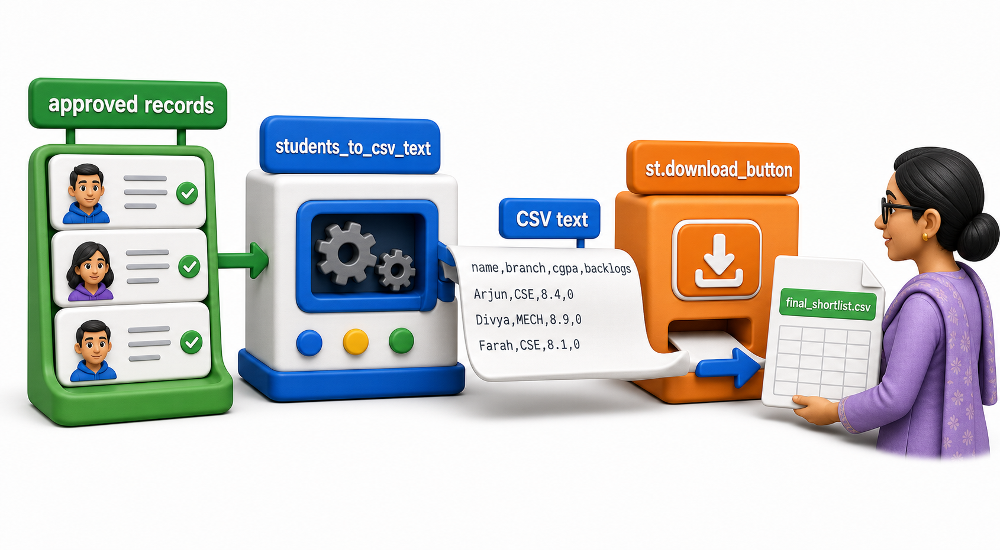

## Introduction

Every lesson so far has used the same four hardcoded students. In reality, the coordinator has a fresh CSV export from the registration form before every drive, and Kavya does not want to hand-edit the student list in code each time. The other direction matters too: once the final list is approved, the coordinator wants to take it away as a file she can attach to an email, not a list of names she has to retype. `st.file_uploader` and `st.download_button` cover both directions.



## Reading an Uploaded CSV

`st.file_uploader` draws a file-picker on the page and, once the coordinator chooses a file, returns a file-like object holding its contents, ready to be read exactly like a file opened with `open(...)`. Working out how to parse that content is ordinary Python, using the standard library's `csv` module, and can be tested without any upload widget at all by standing the uploaded content in as a string.

```python
import csv
import io

# Stands in for the contents of a CSV the coordinator has uploaded.
uploaded_csv_text = """name,branch,cgpa,backlogs
Arjun,CSE,8.4,0
Bhavna,ECE,7.1,1
Chetan,CSE,6.8,2
Divya,MECH,8.9,0"""

def parse_students_csv(file_like):
    reader = csv.DictReader(file_like)
    students = []
    for row in reader:
        students.append({
            "name": row["name"],
            "branch": row["branch"],
            "cgpa": float(row["cgpa"]),
            "backlogs": int(row["backlogs"]),
        })
    return students

file_like = io.StringIO(uploaded_csv_text)
students = parse_students_csv(file_like)
for s in students:
    print(s)
```

```text
{'name': 'Arjun', 'branch': 'CSE', 'cgpa': 8.4, 'backlogs': 0}
{'name': 'Bhavna', 'branch': 'ECE', 'cgpa': 7.1, 'backlogs': 1}
{'name': 'Chetan', 'branch': 'CSE', 'cgpa': 6.8, 'backlogs': 2}
{'name': 'Divya', 'branch': 'MECH', 'cgpa': 8.9, 'backlogs': 0}
```

`io.StringIO` wraps a plain string so it behaves like a file for reading purposes, which is exactly what makes `parse_students_csv` testable without Streamlit running at all: `csv.DictReader` reads rows, converts each field to the right type, and neither knows nor cares whether its input came from a real uploaded file or a hardcoded string.

```text
uploaded_file = st.file_uploader("Upload registered students (CSV)", type="csv")

if uploaded_file is not None:
    students = parse_students_csv(io.TextIOWrapper(uploaded_file))
    st.write(f"Loaded {len(students)} students from the uploaded file")
```

`st.file_uploader` returns `None` until the coordinator actually chooses a file, which is why the parsing only runs inside the `if uploaded_file is not None:` check; on the very first rerun, before any file is picked, there is nothing yet to parse. `parse_students_csv` itself is the exact same function tested above with plain Python, unchanged.



## Building the Data to Download

Going the other direction, the final approved list needs to become CSV text before it can be offered as a download. This, too, is plain Python string-building, testable on its own.

```python
import csv
import io

final_list_records = [
    {"name": "Arjun", "branch": "CSE", "cgpa": 8.4},
    {"name": "Divya", "branch": "MECH", "cgpa": 8.9},
]

def students_to_csv_text(students):
    output = io.StringIO()
    writer = csv.DictWriter(output, fieldnames=["name", "branch", "cgpa"])
    writer.writeheader()
    for s in students:
        writer.writerow(s)
    return output.getvalue()

csv_text = students_to_csv_text(final_list_records)
print(csv_text)
```

```text
name,branch,cgpa
Arjun,CSE,8.4
Divya,MECH,8.9

```

## Offering the Download

```text
csv_text = students_to_csv_text(st.session_state.final_list_records)

st.download_button(
    label="Download Final Shortlist (CSV)",
    data=csv_text,
    file_name="final_shortlist.csv",
    mime="text/csv",
)
```

Unlike `st.button`, which only signals a click happened, `st.download_button` hands the browser a file to save the moment it is clicked, using exactly the `csv_text` string built by `students_to_csv_text`. The coordinator now has a file she can attach to an email, generated from the same `st.session_state.final_list_records` built up one click at a time in the session state lesson.



## Upload and Download at a Glance

| Function | Direction | Returns |
|---|---|---|
| `st.file_uploader` | Coordinator brings data in | A file-like object, or `None` until a file is chosen |
| `st.download_button` | Coordinator takes data out | Nothing to the script; triggers a browser save when clicked |

## Your Turn: Trace the Round Trip

Suppose the coordinator uploads a CSV with five students, Kavya's filter narrows that to two eligible students, and the coordinator clicks "Add" on both before downloading. Name, in order, every plain-Python function from this lesson and the earlier ones that the data passes through, from the uploaded file to the downloaded CSV.

The path is: `parse_students_csv` turns the uploaded file into a list of dictionaries, `shortlist` from the input widgets lesson narrows it to the eligible two, the session state pattern from that lesson accumulates the two approved student records into `st.session_state.final_list_records` across the two clicks, and finally `students_to_csv_text` turns that accumulated list back into CSV text for the download button to hand to the browser.

## Conclusion

`st.file_uploader` and `st.download_button` are the two ends of getting real data into and out of a Streamlit app, but the actual parsing and formatting in between, `parse_students_csv` and `students_to_csv_text` here, is ordinary Python built on the standard library's `csv` and `io` modules, testable on its own with a plain string standing in for a file. With uploads, filtering, session state, and downloads all in place, the final lesson assembles every piece from this course into the one complete placement tool.
