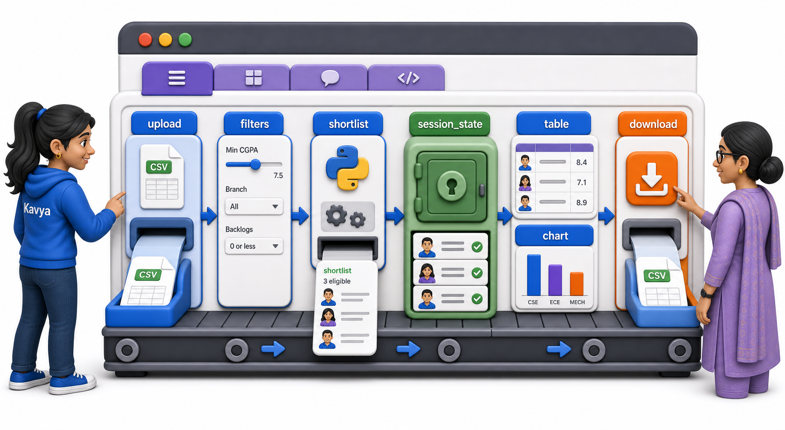
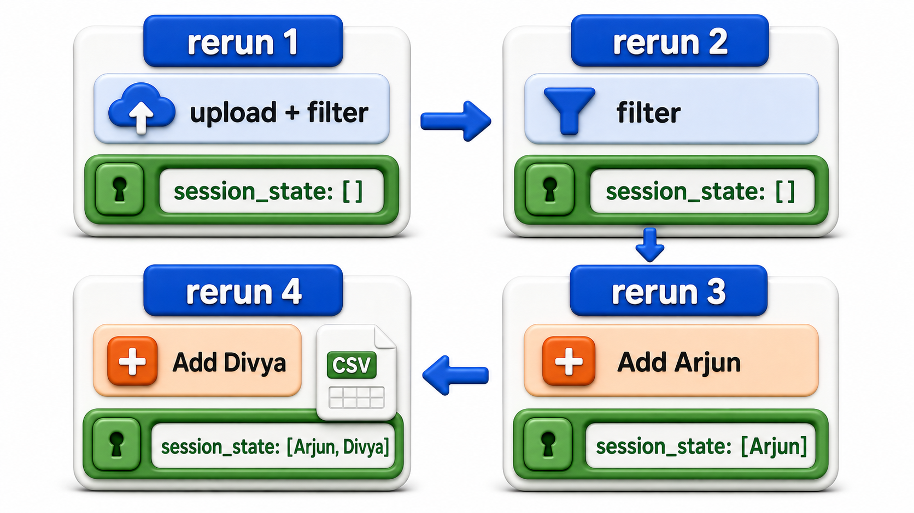
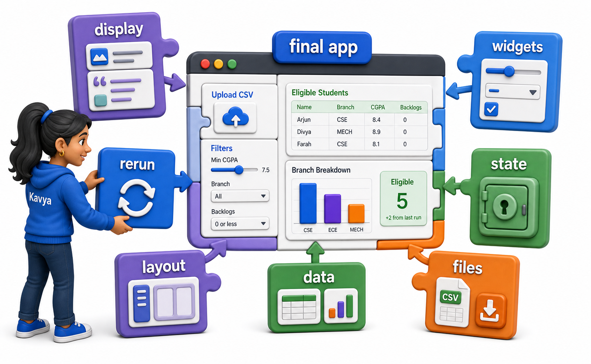

## Introduction

Every piece of Kavya's placement tool now exists on its own: reading an uploaded CSV, filtering by CGPA and backlogs, remembering an approved shortlist across clicks, laying out the sidebar and tabs, showing a table and a chart, and offering the result as a download. This lesson does not introduce anything new; it assembles all seven pieces into the one app the coordinator actually opens, and traces through what a full sequence of her clicks produces.



## The Complete App, as Streamlit Code

```text
import csv
import io
import streamlit as st

st.set_page_config(page_title="Placement Shortlist", page_icon=":clipboard:")

def parse_students_csv(file_like):
    reader = csv.DictReader(file_like)
    return [
        {"name": r["name"], "branch": r["branch"],
         "cgpa": float(r["cgpa"]), "backlogs": int(r["backlogs"])}
        for r in reader
    ]

def shortlist(students, min_cgpa, max_backlogs, branches):
    return [
        s for s in students
        if s["cgpa"] >= min_cgpa
        and s["backlogs"] <= max_backlogs
        and s["branch"] in branches
    ]

def students_to_csv_text(students):
    output = io.StringIO()
    writer = csv.DictWriter(output, fieldnames=["name", "branch", "cgpa"])
    writer.writeheader()
    for s in students:
        writer.writerow({"name": s["name"], "branch": s["branch"], "cgpa": s["cgpa"]})
    return output.getvalue()

st.title("Placement Shortlist Tool")

if "final_list_records" not in st.session_state:
    st.session_state.final_list_records = []

uploaded_file = st.sidebar.file_uploader("Upload registered students (CSV)", type="csv")
min_cgpa = st.sidebar.slider("Minimum CGPA", 0.0, 10.0, 7.5)
max_backlogs = st.sidebar.number_input("Maximum backlogs allowed", min_value=0, value=1)
branches = st.sidebar.multiselect("Branches to include", ["CSE", "ECE", "MECH"], default=["CSE", "ECE", "MECH"])

tab_filter, tab_final = st.tabs(["Filter Results", "Final List"])

with tab_filter:
    if uploaded_file is not None:
        students = parse_students_csv(io.TextIOWrapper(uploaded_file))
        eligible = shortlist(students, min_cgpa, max_backlogs, branches)

        col1, col2 = st.columns(2)
        col1.metric("Total Registered", len(students))
        col2.metric("Eligible", len(eligible))

        st.dataframe(eligible)

        for s in eligible:
            if st.button(f"Add {s['name']} to Final List"):
                st.session_state.final_list_records.append(s)
    else:
        st.write("Upload a CSV to begin.")

with tab_final:
    st.table(st.session_state.final_list_records)
    if st.session_state.final_list_records:
        csv_text = students_to_csv_text(st.session_state.final_list_records)
        st.download_button("Download Final Shortlist (CSV)", csv_text,
                            file_name="final_shortlist.csv", mime="text/csv")
```

Every function here, `parse_students_csv`, `shortlist`, and `students_to_csv_text`, is unchanged from the lessons that introduced them. The only code that is new to this lesson is the wiring: which widget's value feeds which function, which tab a piece of output sits in, and the one `if "final_list_records" not in st.session_state` guard that keeps the approved list alive across every button click.

## Tracing a Full Session

The clearest way to see the whole app working is to simulate the coordinator's actual sequence of actions using the same plain-Python functions, one rerun at a time, exactly as Streamlit would execute the script itself on each interaction.



```python
import csv
import io

def parse_students_csv(file_like):
    reader = csv.DictReader(file_like)
    return [
        {"name": r["name"], "branch": r["branch"],
         "cgpa": float(r["cgpa"]), "backlogs": int(r["backlogs"])}
        for r in reader
    ]

def shortlist(students, min_cgpa, max_backlogs, branches):
    return [
        s for s in students
        if s["cgpa"] >= min_cgpa
        and s["backlogs"] <= max_backlogs
        and s["branch"] in branches
    ]

def students_to_csv_text(students):
    output = io.StringIO()
    writer = csv.DictWriter(output, fieldnames=["name", "branch", "cgpa"])
    writer.writeheader()
    for s in students:
        writer.writerow({"name": s["name"], "branch": s["branch"], "cgpa": s["cgpa"]})
    return output.getvalue()

uploaded_csv_text = """name,branch,cgpa,backlogs
Arjun,CSE,8.4,0
Bhavna,ECE,7.1,1
Chetan,CSE,6.8,2
Divya,MECH,8.9,0"""

session_state = {"final_list_records": []}

def rerun(label, min_cgpa, max_backlogs, branches, add_name=None):
    students = parse_students_csv(io.StringIO(uploaded_csv_text))
    eligible = shortlist(students, min_cgpa, max_backlogs, branches)
    if add_name:
        matched = next(s for s in eligible if s["name"] == add_name)
        session_state["final_list_records"].append(matched)
    approved = [s["name"] for s in session_state["final_list_records"]]
    print(f"{label}: {len(eligible)} eligible, approved so far: {approved}")

# Rerun 1: coordinator uploads the file and views the default filter.
rerun("After upload", min_cgpa=7.5, max_backlogs=1, branches=["CSE", "ECE", "MECH"])

# Rerun 2: coordinator clicks "Add Arjun".
rerun("After adding Arjun", min_cgpa=7.5, max_backlogs=1,
      branches=["CSE", "ECE", "MECH"], add_name="Arjun")

# Rerun 3: coordinator tightens the CGPA cutoff, no click this time.
rerun("After tightening cutoff", min_cgpa=8.5, max_backlogs=1,
      branches=["CSE", "ECE", "MECH"])

# Rerun 4: coordinator clicks "Add Divya".
rerun("After adding Divya", min_cgpa=8.5, max_backlogs=1,
      branches=["CSE", "ECE", "MECH"], add_name="Divya")

print("\nFinal CSV to download:")
print(students_to_csv_text(session_state["final_list_records"]))
```

```text
After upload: 2 eligible, approved so far: []
After adding Arjun: 2 eligible, approved so far: ['Arjun']
After tightening cutoff: 1 eligible, approved so far: ['Arjun']
After adding Divya: 1 eligible, approved so far: ['Arjun', 'Divya']

Final CSV to download:
name,branch,cgpa
Arjun,CSE,8.4
Divya,MECH,8.9

```

Every one of the four `rerun(...)` calls above stands in for one full Streamlit rerun, exactly as the first lesson described: the whole script executing again from the top, `parse_students_csv` and `shortlist` recomputing `eligible` fresh every single time from the current widget values, while `session_state["final_list_records"]` is the one thing that carries over, growing by exactly one entry on the two reruns where a name was actually added.

## What Each Lesson Contributed

| Lesson | Contribution to the final app |
|---|---|
| What is Streamlit | The rerun model; `st.title`, `st.write` in place of `print` |
| Displaying Content | Headings, markdown instructions, page title and icon |
| Input Widgets | Sliders, number input, and multiselect for the filter |
| Session State | `st.session_state.final_list_records`, surviving every click |
| Layout | Sidebar for filters, columns for counts, tabs for views |
| Displaying Data | `st.dataframe` for eligible students, `st.metric` for counts |
| Uploads and Downloads | Bringing the coordinator's own CSV in, sending the shortlist out |



## Your Turn: Extend the Trace

Continue the traced session with a fifth rerun where the coordinator, still at the rerun 3 cutoff of `min_cgpa=8.5`, clicks "Add Bhavna." Work out whether that click would actually add her, and why.

Bhavna's CGPA is 7.1, which never clears even the original 7.5 cutoff from rerun 1, let alone 8.5, so she has not been in `eligible` at any point in this trace. The `next(s for s in eligible if s["name"] == add_name)` line would raise a `StopIteration` looking for a name that is not in the eligible list, which is exactly why a real version of this app would only draw an "Add" button next to students who are currently eligible, making it impossible to click one for a student the filter has already excluded.

## Conclusion

Nothing in this final app is new: the rerun model, widgets, session state, layout, data display, and file handling are the same seven ideas from the seven lessons before this one, arranged onto a single page with the sidebar holding filters, tabs separating the working view from the final list, and one `st.session_state` entry carrying the coordinator's approvals across every click she makes. That is the whole shape of a Streamlit app: ordinary Python functions doing the real work, and a thin layer of widgets and layout calls deciding where their inputs come from and where their results are shown.
